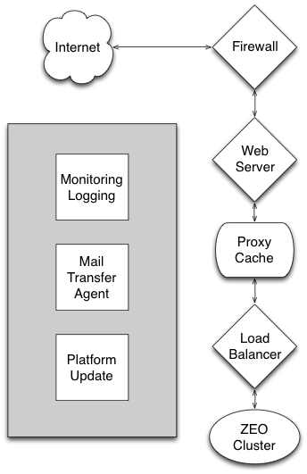

===========================
Automating Plone Deployment
===========================

.. warning::

   This chapter is still work in progress! Expect it to be refactored.

.. .. toctree::
..    :maxdepth: 4
..    :numbered: 1

Introduction
------------

The subject of this training is the deployment of Plone for production purposes.
We will, in particular, be focusing on automating deployment using tools which can target a fresh Linux server and create on it an efficient, robust server.

That target server may be a cloud server newly created on AWS, Linode or DigitalOcean.
Or, it may be a virtual machine created for testing on your own desk or laptop.

Our goal is that these deployments be *repeatable*.
If we run the automated deployment multiple times against multiple cloud servers, we should get the same results.
If we run the automated deployment against a virtual machine on our laptop, we should be able to test it as if it was a matching cloud server.

The tools we use for this purpose reflect the opinions of the Plone Installer Team.
*We are opinionated*.
With a great many years of experience administering servers and Plone, we feel we have a right to our opinions.
But, most importantly, we know we have to make choices and support those choices.

The tools we use may not be the ones you would choose.

They may not be the ones we would choose this month if we were starting over.

But, they are tools widely used in the Plone community.
They are well-understood, and you should get few "I've never heard of that" complaints if you ask questions of the Plone community.

Our big choices
^^^^^^^^^^^^^^^

Linux

    BSD is great.
    OS X is familiar.
    Windows works just fine.
    But our experience and the majority experience in the Plone community is with Linux for production servers.
    That doesn't mean you have to use Linux for your laptop or desktop; anything that runs Python is likely fine.

Major distributions

    We're supporting two target distribution families: Debian and EL (RedHat/CentOS).
    We're going to try to keep this working on the most recent LTS (Long-Term Support release) or its equivalent.

Platform packages

    We use platform packages whenever possible.
    We want the non-Plone components on your server to be automatically updatable using your platform tools.
    If a platform package is usable, we'll use it even if it isn't the newest, coolest version.

Ansible

    There are all sorts of great tools for automating deployment.
    People we respect have chosen Puppet, Salt/Minion and lots of other tools.
    We chose Ansible because it requires no preinstalled server component, it's written in Python, and its configuration language is YAML, which is awfully easy to read.

And ...

    We'll discuss particular parts of the deployment stack in the next section.

Intro to Plone Stack
--------------------

If you haven't read the first couple of chapters of `Guide to deploying and installing Plone in production <http://docs.plone.org/manage/deploying/index.html>`_, take a moment to do so. You'll want to be familiar with the main components of a typical Plone install for deployment and know when each is vital and when unnecessary.



    The generic components of a full-stack Plone installation. Not all are always used.

The Plone Ansible Playbook makes choices for each generic component.


.. figure:: stack-components.png
    :align: center

    The specific components used in Plone's Ansible Playbook.

You are not stuck with our choices. If, for example, you wish to use Apache rather than Nginx for the web server component, that won't be a particular problem. You'll just need to do more work to customize.

Intro to Ansible
----------------

Ansible is an open-source configuration management, provisioning and application deployment platform written in Python and using YAML (YAML Ain't Markup Language) as a configuration language.
Ansible makes its connections from your computer to the target machine using SSH.

There is no server-side component other than an SSH server.
General familiarity with SSH is very desirable if you're using Ansible -- as well as being a baseline skill for server administration.

Installation
^^^^^^^^^^^^

Ansible is usually installed on the orchestrating computer -- typically your desktop or laptop.
It is a large Python application (though a fraction the size of Plone!) that needs many specific Python packages from the Python Package Index (PyPI).

That makes Ansible a strong candidate for a Python ``virtualenv`` installation
If you don't have virtualenv installed on your computer, do it now.

``virtualenv`` may be installed via an OS package manager, or on a Linux or BSD machine with the command:

.. code-block:: bash

    sudo easy_install-2.7 virtualenv

Once you've got ``virtualenv``, use it to create a working directory containing a virtual Python:

.. code-block:: bash

    virtualenv ansible_work

Then, install Ansible there:

.. code-block:: bash

    cd ansible_work
    bin/pip install ansible

Now, to use Ansible, activate that Python environment.

.. code-block:: bash

    source bin/activate
    ansible

.. note::

    Trainers: check to make sure everyone understands the basic ``source activate`` mechanism.

Now, let's get a copy of the *Plone Ansible Playbook*.
Make sure you're logged to your ansible_work directory.

Unless you're participating in the development of the playbook, or need a particular fix, you'll want to clone the ``STABLE`` branch.
The STABLE branch is a pointer to the last release of the playbook.

.. code-block:: bash

    git clone -b STABLE --single-branch https://github.com/plone/ansible-playbook.git

Or,

.. code-block:: bash

    git clone https://github.com/plone/ansible-playbook.git
    cd ansible-playbook
    git checkout STABLE

That gives you the Plone Ansible Playbook.
You'll also need to install a few Ansible roles.
Roles are Ansible playbooks packaged for distribution.
Fortunately, you may pick up everything with a single command.

.. code-block:: bash

    cd ansible-playbook
    ansible-galaxy install -p roles -r requirements.yml

If you forget that command, it's in the short README.rst file in the playbook.

.. note::

    The rationale for checking the Plone Ansible Playbook out inside the virtualenv directory is that it ties the two together.
    Months from now, you'll know that you can use the playbook with the Python and Ansible packages in the virtualenv directory.
    We check out the playbook as a subdirectory of the virtualenv directory so that we can search our playbooks and roles without having to search the whole virtualenv set of packages.

Ansible basics
^^^^^^^^^^^^^^

Connecting to remote machines
`````````````````````````````

To use Ansible to provision a remote server, we have two requirements:

1. We must be able to connect to the remote machine using ``ssh``; and,

2. We must be able to issue commands as the on the remote server as root (superuser), usually via ``sudo``.

You'll need to familiarize yourself with how to fulfill these requirements on the cloud/virtual environment of your choice.
Examples:

Using Vagrant/virtualbox

    You will initially be able to log in as the "vagrant" user using a private key that's in a file created by Vagrant.
    The user "vagrant" may issue ``sudo`` commands with no additional password.

Using Linode

    You'll set a root password when you create your new machine. If you're willing to use the root user directly, you will not need a ``sudo`` password.

When setting up a Digital Ocean machine

    New machines are typically created with a root account that contains your ssh public key as an authorized key.


AWS

    AWS EC2 instances are typically created with a an account named "root" or a short name for the OS, like "ubuntu", that contains your ssh public key as an authorized key.
    Passwordless ``sudo`` is pre-enabled for that acount.

The most important thing is that you know your setup. Test that knowledge by trying an ssh login and issuing a superuser command.


.. code-block:: bash

    ssh myuser@myhost.com   # (what user/hostname did you use? are you asked a password?)
    ...
    myhost.com $ sudo ls  # (are you asked for your password?)

Inventories
```````````

Ansible is usually run on a local computer, and it usually acts on one or more remote machines.
We tell Ansible how to connect to remote machines by maintaining a text inventory file.

There is a sample inventory configuration file in your distribution.
It's meant for use with a Vagrant-style virtualbox.

.. code-block:: bash

    cat vbox.cfg

.. code-block:: ini

    myhost ansible_port=2222 ansible_host=127.0.0.1 ansible_user=vagrant ansible_private_key_file=~/.vagrant.d/insecure_private_key

This inventory file is complicated by the fact that a virtualbox typically has no DNS host name and uses a non-standard port and a special SSH key file.
So, we have to specify all those things.

If we were using a DNS-known hostname and our standard ssh key files, it could be much simpler:

.. code-block:: ini

    direct.newhost.com ansible_ssh_user=root

Ansible inventory files may list multiple hosts and may have aliases for groups of hosts. See docs.ansible.com for details.

Playbooks
^^^^^^^^^

We're going to cover just enough on Ansible playbooks to allow you to read and customize Plone's playbook.
`Ansible's documentation <http://docs.ansible.com>`_ is excellent if you want to learn more.

In Ansible, an individual instruction for the setup of the remote server is called a task.
Here's a task that makes sure a directory exists.

.. code-block: yaml

    - name: Ensure base directory
      file:
        path=/usr/local/plone
        state=directory
        mode=0755

This uses the Ansible ``file`` module to check to see if a directory exists with the designated mode.
If it doesn't, it's created.

Tasks may also have execution conditions expressed in Python syntax and may iterate over simple data structures.

In addition to tasks, Ansible's basic units are host and variable specifications.

An Ansible ``playbook`` is a specification of tasks that are executed for specified hosts and variables.
All of these specifications are in YAML.

Quick intro to YAML
```````````````````

YAML isn't a markup language, and it isn't a programming language either.
It's a data-specification notation.
Just like JSON.
Except that YAML -- very much unlike JSON -- is meant to be written and read by humans.
The creators of YAML call it a "human friendly data serialization standard".

.. note::

    YAML is actually a superset of JSON.
    Every JSON file is also a valid YAML file.
    But if we just fed JSON to the YAML parser, we'd be missing the point of YAML, which is human readability.

Basic types available in YAML include strings, booleans, floating-point numbers, integers, dates, times and date-times.
Structured types are sequences (lists) and mappings (dictionaries).

Sequences are indicated by list-member lines with leading dashes:

.. code-block:: yaml

    - item one
    - item two
    - item three

Mappings are indicated with key/value pairs with colons separating keys and values:

.. code-block:: yaml

    one: item one
    two: item two
    three: item three

Complex data structures are designated with indentation:

.. code-block:: yaml

    # a mapping of sequences
    american:
      - Boston Red Sox
      - Detroit Tigers
      - New York Yankees
    national:
      - New York Mets
      - Chicago Cubs
      - Atlanta Braves

    # a sequence of mappings
    -
      name: Mark McGwire
      hr:   65
      avg:  0.278
    -
      name: Sammy Sosa
      hr:   63
      avg:  0.288

Basic types read as you'd expect:

.. code-block:: yaml

    - one  # string "one"
    - 1    # integer 1
    - 1.0  # float 1.0
    - True # boolean True
    - true # also boolean True
    - yes  # also boolean True

Finally, remember that this is a superset of JSON:

.. code-block:: yaml

    - {a: one, b: two}   # mapping
    - [one, two, three]  # sequence

Want to turn YAML into Python data structures?
Or Python into YAML?
Python has several YAML parser/generators.
The most commonly used is PyYAML.

Quick code to read YAML from the standard input and turn it into pretty-printed Python data:

.. literalinclude:: read_yaml.py
   :language: python

Quick intro to Jinja2
`````````````````````

YAML doesn't have any built-in way to read a variable.
Ansible uses the Jinja2 templating language for this purpose.

A quick example: Let's say we have a variable ``timezone`` containing the target server's desired timezone setting.
We can use that variable in a task via Jinja2's double-brace notation: ``{{ timezone }}``.

Jinja2 also supports limited Python expression syntax and can read object properties or mapping key/vaues with a dot notation::


    {{ instance_config.plone_version < '5.0' }}

There are also various filters and tests available via a pipe notation.
For example, we use the ``default`` filter to supply a default value if a variable is undefined.

.. code-block:: yaml

    - name: Set timezone variables
      tags: timezone
      copy: content={{ timezone|default("UTC\n") }}
            dest=/etc/timezone
            owner=root
            group=root
            mode=0644
            backup=yes

Jinja2 also is used as a full templating language whenever we need to treat a text file as a template to fill in variable values or execute loops or branching logic.
Here's an example from the template used to construct a buildout.cfg:

.. code-block:: ini

    zcml =
    
    
        {{ slug }}
    
    


Playbook structure
``````````````````

An Ansible "play" is a mapping (or dictionary) with keys for hosts, variables and tasks.
A playbook is a sequence of such dictionaries.

A simple playbook:

.. code-block:: yaml

    - hosts: all
      vars:
        ... a dictionary of variables
      tasks:
        ... a sequence of tasks

The value of hosts could be a single host name, the name of a group of hosts, or "all".

Variables
:::::::::

Notifications and handlers
::::::::::::::::::::::::::

We may also specify "handlers" that are run if needed.

.. code-block:: yaml

    - hosts: all
      vars:
        ... a dictionary of variables
      tasks:
        - name: Change webserver setup
          ...
          notify: restart webserver
        ...
      handlers:
        - name: restart webserver
          service: webserver
          state: restarted

Handlers are run if a matching notification is registered.
A particular handler is only run once, even if several notifications for it are registered.

Roles
:::::

Ansible has various ways to include the contents of YAML files into your playbook.
"Roles" do it in a more structured way -- much more like a package.
Roles contain their own variables, tasks and handlers.
They inherit the global variable environment and you may pass particular variables when they are called.

Plone's Ansible Playbook includes several roles for chores such as setting up the load balancer and web server.
Other roles are fetched (the role source itself is fetched) by ``ansible-galaxy`` when we use it to set up requirements.
Most are fetched from github.

An simple Ansible playbook using roles:

.. code-block:: yaml

    - hosts: all
      vars:
        ... a dictionary of variables
      pre-tasks:
        ... tasks executed before roles are used.
      roles:
        ... a sequence of role invocation mappings like:
        - role: haproxy
          var1: value1
          var2: value2
          when: install_loadbalancer|default(True)
        ...
      tasks:
        ... other tasks, executed after the roles
      handlers:
        ... handlers for our own tasks; roles usually have their own

If we want to pass variables to roles, we just add their keys and values to the mapping.

Take a look at the ``when: install_loadbalancer|default(True)`` line above.
A ``when`` key in a role or task mapping sets a condition for execution.
For conditionals like ``when``, Ansible expects a Jinja2 expression.

We could also have expressed that ``when`` condition as ``"{{ install_loadbalancer|default(True) }}"``.
Ansible interprets all literal strings as little Jinja2 templates.

The Plone Playbook
------------------

Checkout
^^^^^^^^

Requirements
^^^^^^^^^^^^

Quick review of contents
^^^^^^^^^^^^^^^^^^^^^^^^

Vagrant
```````

Sample configurations
`````````````````````

The playbook kit contains several sample configuration files.

sample-very-small.yml

    Targets a server with 512MB of memory and one CPU core.
    Sets up one ZEO client with two threads with very small object caches.
    No load balancer.
    Varnish cache is file-based.

sample-small.yml

    Targets a server with 1GB of memory and one CPU core.
    Sets up one ZEO client with two threads with small object caches.
    No load balancer.
    Varnish cache is file-based.

sample-medium.yml

    Targets a server with 2GB of memory and two CPU cores.
    Sets up two ZEO clients, each with one thread with a medium object cache.
    Uses load balancer to manage the queue to the ZEO clients.
    Varnish cache is memory-based.

sample-multiserver.yml

    A configuration that demonstrates how to run multiple Zope/Plone installs with different versions and virtual hosting.

The first four samples are meant to be immediately useful.
Just copy and customize.
The multiserver sample is just a demonstration of several customization techniques.
Read it for examples, but don't expect to use it without substantial customization.

Why no ``sample-large.yml``?
Because a larger server installation is always going to require more thought and customization.
We'll discuss those customization points later.
The ``sample-medium.yml`` file will give you a starting point.

Basic use
^^^^^^^^^

Local configuration file
````````````````````````

For a quick start, copy one of the ``sample-*.yml`` files to ``local-configure.yml``.
The ``local-configure.yml`` file is automatically included in the main playbook if it's found.

.. code-block:: bash

    cp sample-small.yml local-configure.yml

Now, edit the ``local-configure.yml`` file to set some required variables:

admin_email

    The server admin's email.
    Probably yours.
    This email address will receive system notices and log analysis messages.

plone_initial_password

    The initial administrative password for the Zope/Plone installation.
    Not the same as the server shell login.

muninnode_query_ips

    Are you going to run a Munin monitor on a separate machine?
    (And, if not, why not?)
    Specify the IP address of the monitor machine.
    Or ...

install_muninnode

    Remove the "#" on the ``install_muninnode: no`` line if you are not using a Munin monitor.

You're also nearly certainly going to want to specify a Plone version via the ``plone_version`` setting.
You should be able to pick any version from 4.3.x or 5.x.x.
Note that the value for this variable must be quoted to make sure it's interpreted as a string.

Use with Vagrant
::::::::::::::::

If you've installed Vagrant/Virtualbox, you're ready to test.
Since Vagrant manages the connection, you don't need to create a inventory file entry.

There is a Vagrant setup file, ``Vagrantfile``, included with the playbook, so you may just open a command-line prompt, make sure your Ansible virtualenv is activated, and type:

.. code-block:: bash

    vagrant up

.. note::

    The first time you use a "box" it will be downloaded.
    These are large downloads; expect it to take some time.

.. note::

    Instructor note:
    Having several students simultaneously downloading a virtualbox over wifi or a slow connection is a nightmare.
    Have a plan.

Once you've run ``vagrant up``, running it again will not automatically provision the virtualbox.
In this case, that means that Ansible is not run.
So, if you change your Ansible configuration, you'll need to use:

.. code-block:: bash

    vagrant provision

.. note::

    When you run ``up`` or ``provision``, watch to make sure it completes successfully.
    Note that failures for particular plays do not mean that Ansible provisioning failed.
    The playbook has some tests that fail if particular system features are unavailable.
    Those test failures are ignored and the provisioning continues.
    The provisioning has only failed if an error causes it to stop.

An example of an ignored failure::

    TASK [varnish : Using systemd?] ************************************************
    fatal: [trusty]: FAILED! => {"changed": true, "cmd": "which systemctl && systemctl is-enabled varnish.service", "delta": "0:00:00.002085", "end": "2016-09-14 17:50:06.385887", "failed": true, "rc": 1, "start": "2016-09-14 17:50:06.383802", "stderr": "", "stdout": "", "stdout_lines": [], "warnings": []}
    ...ignoring


Vagrant ports
!!!!!!!!!!!!!

The Vagrant setup (in ``Vagrantfile``) maps several ports on the guest machine (the virtualbox) to the host box.
The general scheme is to forward a host port that is 1000 greater than the guest port.
For example, the load-balancer monitor port on the guest server is ``1080``.
On the host machine, that's mapped by ssh tunnel to 2080.
So, we may see the haproxy monitor at ``http://localhost:2080/admin``.

The guest's http port (80) is reached via the host machine's port 1080 --
but that isn't actually very useful due to URL rewriting for virtual hosting.
If you take a look at ``http://localhost:1080`` from your host machine, you'll see the default Plone site, but stylesheets, javascript and images will all be missing.
Instead, look at the load-balancer port (8080 on the guest, 9080 on the host) to see your ZODB root.

Some quick Vagrant
!!!!!!!!!!!!!!!!!!

..code-block:: bash

    vagrant up                 # bring up the virtualbox
    vagrant provision          # provision the virtualbox
    vagrant up --no-provision  # bring the box up without provisioning
    vagrant halt               # stop and save the state of the virtualbox
    vagrant destroy            # stop and destroy the box
    vagrant ssh                # ssh to the guest box

To each of the these commands, you may add an id to pick one of the boxes defined in Vagrantfile.
Read Vagrantfile for the ids.
For example, ``centos7`` is the id for a CentOS box.

..code-block:: bash

    vagrant up centos7

Run against cloud
:::::::::::::::::

Let's provision a cloud server.
Here are the facts we need to know about our cloud server:

hostname

    A new server may or may not have a DNS host entry.
    If it does, use that hostname.
    If not, invent one and be prepared to supply an IP address.

login id

    The user id of a system account that is either the superuser (root) or is allowed to use ``sudo`` to issue arbitrary commands as the superuser.

password

    If your cloud-hosting company does not set up the user account for ssh-keypair authentication, you'll need a password.
    Even if your account does allow passwordless login, it may still require a password to run ``sudo``.

    If your cloud-hosting company sets up a root user and password, it's a good practice to login (or use Ansible) to create a new, unprivileged user with sudo rights.
    Cautious sysadmins will also disable root login via ssh.

connection details

    If you don't have a DNS host record for your server, you'll need to have its IP address.
    If ssh is switched to an alternate port, you'll need that port number.

With that information, create an inventory file (if none exists) and create a host entry in it.
We use ``inventory.cfg`` for an inventory file.
A typical inventory file::

    www.mydomain.co.uk ansible_host=192.168.1.1 ansible_user=steve

You may leave off the ``ansible_host`` if the name supplied matches the DNS host record.
You may leave off the ``ansible_user`` if your user id is the same on the server.

An inventory file may have many entries.
You may run Ansible against one, two, all of the hosts in the inventory file, or against alias groups like "plone-servers".
See `Ansible's inventory documentation <http://docs.ansible.com/ansible/intro_inventory.html>`_ for information on grouping host entries and for more specialized host settings.

Now, let's make things easier for us going forward by creating an ``ansible.cfg`` file in our playbook directory.
In that text file, specify the location of your inventory file:

..code-block::

    [defaults]
    inventory = ./inventory.cfg
    roles_path = ./roles

Smoke test
``````````

Now, let's see if we can use Ansible to connect to the remote machine that we've specified in our inventory.

Does the new machine allow an ssh key login, then you ought to be able to use the command:

.. code-block:: bash

    ansible www.mydomain.co.uk -a "whoami"

If you need a password for login, try:

.. code-block:: bash

    ansible www.mydomain.co.uk -a "whoami" -k

And, if that fails, ask for verbose feedback from Ansible:

.. code-block:: bash

    ansible www.mydomain.co.uk -a "whoami" -k -vvvv

Now, let's test our ability to become superuser on the remote machine.
If you have passwordless sudo, this should work:

.. code-block:: bash

    ansible www.mydomain.co.uk -a "whoami" -k --become
    # omit the "-k" if you need no login password.

If sudo requires a password, try:

.. code-block:: bash

    ansible www.mydomain.co.uk -a "whoami" -k --become -K
    # again,  omit the "-k" if you need no login password.

If all that works, congratulations, you're ready to use Ansible to provision the remote machine.

.. note::

    The "become" flag tells Ansible to carry out the action while becoming another user on the remote machine.
    If no user is specified, we become the superuser.
    If no method is specified, it's done via ``sudo``.

    You won't often use the ``--become`` flag because the playbooks that need it specify it themselves.

Daignosing ssh connection failures
``````````````````````````````````

If Ansible has trouble connecting to the remote host, you're going to get a message like:

.. code-block:: ruby

    myhost | UNREACHABLE! => {
        "changed": false,
        "msg": "Failed to connect to the host via ssh.",
        "unreachable": true
    }

If this happens to you, try adding ``-vvv`` to the ``ansible`` or ``ansible-playbook`` command line.
The extra information may -- or may not -- be useful.

The real test is to use a direct ssh login in order to get the ssh error.
There's a pretty good chance that the identity of the remote host will have changed, and ssh will give you a command line to clean it up.

Running the playbook
````````````````````

We're ready to run the playbook.
Make sure you're logged to your ansible-playbook directory and that you've activated the Python virtualenv that includes Ansible.

If you're targetting all the hosts in your inventory, running the playbook may be as easy as:

.. code-block:: bash

    ansible-playbook playbook.yml

If you need a password for ssh login, add ``-k``.

If you need a password for sudo, add ``-K``.

If you need a password for both, add "-k -K".

If you want to target a particular host in your inventory, add ``--limit=hostname``. Note that the ``--limit`` parameter is a search term; all hostnames matching the parameter will run.

.. note::

    As with Vagrant, check the last message to make sure it completes successfully.
    When first provisioning a server, timeout errors are more likely.
    If you have a timeout, just run the playbook again.
    Note that failures for particular plays do not mean that Ansible provisioning failed.

In operation
^^^^^^^^^^^^

.. code-block::

    This server is configured via Ansible.
    Do not change configuration settings directly.

    Admin email: steve@dcn.org
    Custom Services/Ports
    zeoserver: /usr/local/plone-5.0/zeoserver
        /Plone: myhost [u'default']
        zeo server: 127.0.0.1:8100
        haproxy front end: 8080
        zeo clients: 127.0.0.1:8081 127.0.0.1:8082
    haproxy monitor: 127.0.0.1:1080
    varnish: 127.0.0.1:6081
    varnish admin: 127.0.0.1:6082
    postfix: 25 (host-only)
    nginx:
    - myhost: *:80

ZODB root notes


    Typical virtual hosting error.


ports, monitors, supervisor, restart script, log messages


    Haproxy monitor at :1080/admin


postfix

autoupdate

fail2ban

changes philosophy (via Ansible, not shell)

Firewalling
:::::::::::

blocked ports and ssh tunneling

More customized use
^^^^^^^^^^^^^^^^^^^

Common customization points
```````````````````````````

Plone setup
:::::::::::

Eggs and versions
!!!!!!!!!!!!!!!!!

Extra files/directories
!!!!!!!!!!!!!!!!!!!!!!!

buildout from git repo
!!!!!!!!!!!!!!!!!!!!!!

Virtual hosting
:::::::::::::::

extra tricks

Multiple Plones per host
````````````````````````

Maintenance strategies (simple)
^^^^^^^^^^^^^^^^^^^^^^^^^^^^^^^

Git checkout -- simple
``````````````````````

Git branch or fork
``````````````````

What belongs to the playbook and what doesn't
`````````````````````````````````````````````

Maintenance strategies -- multiple hosts
^^^^^^^^^^^^^^^^^^^^^^^^^^^^^^^^^^^^^^^^


The Plone Role -- using it independently
----------------------------------------


Helping develop Plone's Ansible tools
-------------------------------------

.. seealso::

   http://docs.plone.org/manage/deploying/