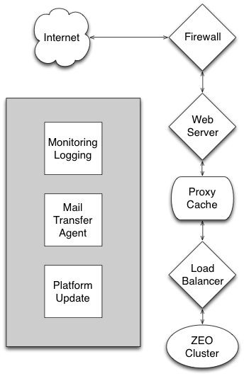
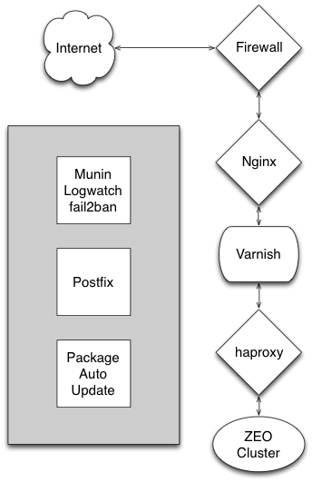

Intro to Plone Stack
--------------------

If you haven't read the first couple of chapters of `Guide to deploying and installing Plone in production <http://docs.plone.org/manage/deploying/index.html>`_, take a moment to do so. You'll want to be familiar with the main components of a typical Plone install for deployment and know when each is vital and when unnecessary.

    The generic components of a full-stack Plone installation. Not all are always used.

The Plone Ansible Playbook makes choices for each generic component.

    The specific components used in Plone's Ansible Playbook.

You are not stuck with our choices. If, for example, you wish to use Apache rather than Nginx for the web server component, that won't be a particular problem. You'll just need to do more work to customize.

