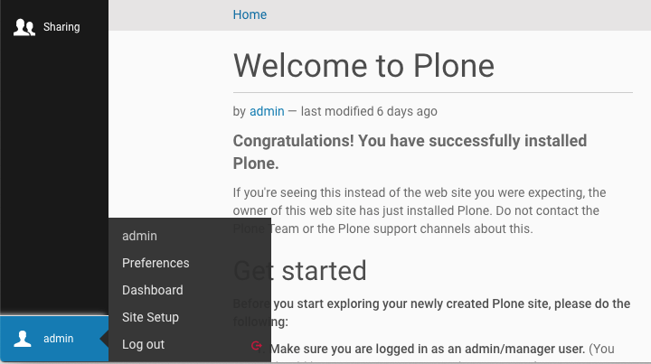

.. _add-ons-label:

Extending Plone With Add-on Packages
=================================

.. sidebar:: Classic and Volto chapter

  .. contents:: Table of Contents
    :depth: 2
    :local:

* There are more than 2,000 add-ons for Plone. We will cover only a handful today.
* Using them saves a lot of development time.
* The success of a project often depends on finding the right add-on.
* Their use, usefulness, quality and complexity varies a lot.

With Plone 6 there are two groups of add-ons to take in to account: Add-ons for Plone and such for the frontend Volto.

The need of Plone add-ons depends if you use Plone with or without Volto frontend. As by now, development took place in Plone. Now development will be done in Plone exclusively like before or both in Plone and in ReactJS.

Plone add-ons

* add content types
* add features
* 

.. todo::

    list features of classic Plone add-ons

Having a Volto frontend in place, you will have Plone add-ons with some of the characteristics like above but also Volto add-ons that care about presentation of the content and editor experience.

.. todo::

    distinction: Plone add-on vs Volto add-on: I have this feature to implement, where do I start?

We begin with the scenario where we use both Plone as backend and Volto as frontend. Later on in this chapter you will find instructions on how to use a classic Plone setup without Volto with the huge repertoire of classic Plone add-ons. This might still be an option as the number of Volto add-ons is just on the way to catch up on all the features and posibilites of Plone add-ons.

.. _add-ons-volto-overview-label:

Volto Add-ons
-------------

| A selection of add-ons can be found on: 
| https://github.com/collective/awesome-volto#addons    

| One typical add-on is about adding a new block to present content in columns:
| https://github.com/eea/volto-columns-block

.. figure:: _static/volto-columns-block.png
    :alt: The eea volto-columns-block package gives you a block with columns. Each column is its own separate blocks container.

Here is how you would install a Volto add-on:

Update `package.json`:

..  code-block:: bash

    "addons": [
      "@eeacms/volto-blocks-form",
      "@eeacms/volto-columns-block"
    ],

    "dependencies": {
      "@plone/volto": "8.3.0",
      "@eeacms/volto-blocks-form": "github:eea/volto-blocks-form#0.5.0",
      "@eeacms/volto-columns-block": "github:eea/volto-columns-block#0.3.2"
    },

Install new add-ons and restart Volto:

..  code-block:: bash

    $ yarn
    $ yarn start

.. _add-ons-volto-backedupbyplone-label

Complementing Volto with Plone add-ons
--------------------------------------

With some additional features of Volto add-ons in place, where do we need to work on the Plone side? With the split of Plone in backend and frontend, Plone is still the place to shape your data model. For our training story 'Platform for a Plone Conference' we need to model the content types talk and speaker. 

So in the next chapters we will create a **new add-on** that adds the content types talk and speaker. We will also **use an existing add-on** that provides us with the logic to handle votes on talks.

.. _add-ons-notable-label:

Some notable Plone add-ons for a classic Plone setup without Volto frontend
---------------------------------------------------------------------------

`collective.easyform <https://pypi.org/project/collective.easyform>`_
  A form generator and the successor to `Products.PloneFormGen <https://docs.plone.org/develop/plone/forms/ploneformgen.html>`_

  .. figure:: _static/add_ons_easyform_1.png
      :scale: 50%
      :alt: A simple form created with collective.easyform.

      A simple form created with collective.easyform.

  .. figure:: _static/add_ons_easyform_2.png
      :scale: 50%
      :alt: Editing a form field through the web.

      Editing a form field through the web.

`plone.app.mosaic <https://github.com/plone/plone.app.mosaic>`_
  Layout solution to easily create complex layouts through the web.

`collective.geo <https://collectivegeo.readthedocs.io/en/latest/>`_
  Flexible bundle of add-ons to geo-reference content and display in maps

`collective.mailchimp <https://pypi.org/project/collective.mailchimp>`_
  Allows visitors to subscribe to mailchimp newsletters

`eea.facetednavigation <https://pypi.org/project/eea.facetednavigation/>`_
  Create faceted navigation and searches through the web.

`collective.lineage <https://pypi.org/project/collective.lineage>`_
  Microsites for Plone - makes subfolders appear to be autonomous Plone sites

`collective.behavior.banner <https://github.com/collective/collective.behavior.banner>`_
  Add decorative banners and sliders

`Rapido <https://rapidoplone.readthedocs.io/en/latest/>`_
  Allows developers with a little knowledge of HTML and a little knowledge of Python to implement custom elements and insert them anywhere they want.

`Plomino <https://github.com/plomino/Plomino>`_
  Powerful and flexible web-based application builder for Plone

`collective.disqus <https://pypi.org/project/collective.disqus/>`_
  Integrates the Disqus commenting platform API into Plone

.. _add-ons-find-label:

How to find add-ons
-------------------

It can be very hard to find the right add-on for your requirements. Here are some tips:

* Make a list of required features. You'll almost never find an add-on that exactly fits your needs.
* Either adapt your requirements to what is available, invest the time & money to modify an existing add-ons to fit your needs or create a new add-on that does exactly what you need.
* Then search using the follwing links below.

  * https://plone.org/download/add-ons
  * https://pypi.org >3400 Plone related packages - use the search form!
  * https://github.com/collective >1500 repos
  * https://github.com/plone >310 repos
  * google (e.g. `Plone+Slider <http://google.com/?q=plone+slider>`_)
  * https://www.npmjs.com/search?q=plone

* Once you have a shortlist test these add-ons. Here are the main issues you need to test before you install an add-on on a production site:

  * Test all required features. Read but do not trust the documentation
  * Check if the add-on runs on your required version and is currently maintained
  * Does it have i18n-support, i.e. is the user-interface translated to your language?
  * Does it uninstall cleanly?
    A tough one.
    See https://lucafbb.blogspot.com/2013/05/how-to-make-your-plone-add-on-products.html for the reason why.
  * Check for unwanted dependencies

Once you found an add-on you like you should ask the community if you made a good choice or if you missed something:

* Message Board: https://community.plone.org
* Chat: https://plone.org/support/chat

There is also a talk that discusses in depth how to find the right add-on: https://www.youtube.com/watch?v=Sc6NkqaSjqw

.. _add-ons-installing-label:

Installing Plone Add-ons
------------------------

Installation is a two-step process.

Making the add-on packages available to Zope
++++++++++++++++++++++++++++++++++++++++++++

First, we must make the add-on packages available to Zope. This means that Zope can import the code. Buildout is responsible for this.

Look at the :file:`buildout.cfg`.

.. note::

    If you're using our Vagrant kit, the Plone configuration is available in a folder that is shared between the host and guest operating systems.
    Look in your Vagrant install directory for the :file:`buildout` folder.
    You may edit configuration files using your favorite text editor in the host operating system, then switch into your virtual machine to run buildout on the guest operating system.

In the section ``[instance]`` there is a variable called ``eggs``, which has a list of *eggs* as a value. For example::

    eggs =
        Plone
        collective.easyform
        plone.app.debugtoolbar

You add an egg by adding a new line containing the package name to the configuration.
You must write the egg name indented: this way, buildout understands that the current line is part of the last variable and not a new variable.

If you add new add-ons here you will have to run buildout and restart the site:

.. sourcecode:: bash

    $ bin/buildout
    $ bin/instance fg

Now the code is available from within Plone.

Installing add-ons in your Plone Site
+++++++++++++++++++++++++++++++++++++

Your Plone site has not yet been told to use the add-on. For this, you have to activate the add-on in your Plone Site.

.. note::

    Why the extra step of activating the add-on package? You may have multiple Plone sites in a single Zope installation. It's common to want to activate some add-ons in one site, others in another.

In your browser, go to Site Setup (shortcut: add ``/@@overview-controlpanel`` to the Plone site URL), and open the ``Add-ons`` Panel. You will see that you can install the add-ons there.

      Link to Site Setup

Install EasyForm (the human-readable name of :py:mod:`collective.easyform`) now.

This is what happens: The GenericSetup profile of the product gets loaded. This does things like:

* Configuring new actions
* Registering new content types
* Registering css and js files
* Creating some content/configuration objects in your Plone site.

Let's have a look at what we just installed.

.. _add-ons-PFG-label:

collective.easyform
-------------------

There are many ways to create forms in Plone:

* Pure: html and python in a BrowserView
* Framework: :py:mod:`z3c.form`
* TTW: :py:mod:`Products.PloneFormGen` and :py:mod:`collective.easyform`

The concept of :py:mod:`collective.easyform` is that you add a form, to which you add form fields as schema-fields exactly like the dexterity schema-editor. Fields are added, deleted, edited and moved just as with any other type of content. Form submissions may be automatically emailed and/or saved for download.

Let's build a registration form:

* Add an object of the new type 'EasyForm' in the site root. Call it "Registration"
* Save and view the result, a simple contact form that we may customize
* In the `Actions` Menu click on "Define form fields"
* Remove field "comments"
* Add fields for food preference (a choice field) and shirt size (also choice)
* In the `Actions` Menu click on "Define form actions"
* Add a new action and select "Save Data" as the type. This stores all entered data.
* Customize the mailer

.. note::

    Need CAPTCHAs? Read the `instructions how to add add Recapcha-field to easyform <https://github.com/collective/collective.easyform#recaptcha-support>`_

.. _add-ons-ptg-label:

Add page layout management with :py:mod:`plone.app.mosaic`
------------------------------------------------------------

To let your site editors drag and drop different blocks of content onto a page, you can use the add-on plone.app.mosaic
https://pypi.org/project/plone.app.mosaic/

* Add `plone.app.mosaic` to the eggs section in the buildout.
* Activate the Mosaic add-on.
* Go to a page in your site and click on "Mosaic" in the `Display` menu in the toolbar.
* Edit the page to select a Mosaic layout and try inserting some content blocks.
* You can read more about the concepts and use of this add-on in the `Mosaic documentation <http://plone-app-mosaic.s3-website-us-east-1.amazonaws.com/latest/getting-started.html>`_

.. note::

    The Mosaic editor takes some time to load so please be patient until you see the full edit view.

.. _add-ons-i18n-label:

Internationalization
--------------------

Plone can run the same site in many different languages.

We're not doing this with the conference site since the *lingua franca* of the Plone community is English.

We would use the built-in add-on `plone.app.multilingual <https://pypi.org/project/plone.app.multilingual>`_ for this.

Building a multi-lingual site requires activating :py:mod:`plone.app.multilingual`, but no add-on is necessary to build a site in only one language. Just select a different site language when creating a Plone site, and all text in the user-interface will be switched to that language.

.. _add-ons-summary-label:

Summary classic Plone
---------------------

You are now able to customize and extend many parts of our website. You can even install extensions that add new functionality.
