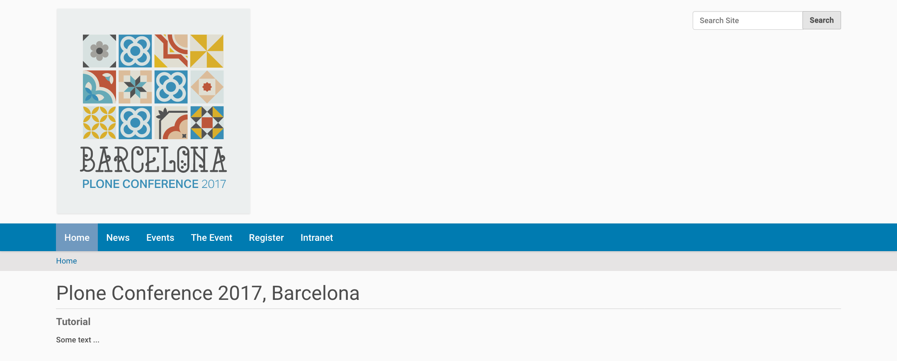

.. _customizing-label:

Configuring and Customizing Plone "Through The Web"
===================================================

..  warning::

    This chapter has not yet been updated for Plone 5!

 .. sectionauthor:: Philip Bauer <bauer@starzel.de>

.. _customizing-controlpanel-label:

The Control Panel
-----------------

The most important parts of Plone can be configured in the control panel.

* Click on the portrait/username in the toolbar
* Click :guilabel:`Site Setup`

We'll explain every page and mention some of the actions you can perform here.

General
*******

#. Date and Time
#. Language
#. Mail
#. Navigation
#. Site
#. Add-ons
#. Search
#. Discussion
#. Theming
#. Social Media
#. Syndication
#. TinyMCE

Content
*******

#. Content Rules
#. Editing
#. Image Handling
#. Markup
#. Content Settings
#. Dexterity Content Types

Users
*****

#. Users and Groups

Security
********

#. HTML Filtering
#. Security
#. Errors

Advanced
********

#. Maintenance
#. Management Interface
#. Caching
#. Configuration Registry
#. Resource Registries

Below the links you will find information on your Plone, Zope and Python Versions and an indicator as to whether you're running in production or development mode.

Change the logo
+++++++++++++++

Let's change the logo.

* Download a ploneconf logo: https://www.starzel.de/plone-tutorial/logo.png
* Go to http://localhost:8080/Plone/@@site-controlpanel
* Upload the Logo.

    The view of the homepage with the customized logo.

.. seealso::

   https://docs.plone.org/adapt-and-extend/change-the-logo.html

.. _customizing-portlets-label:

Portlets
--------

In the toolbar under :guilabel:`More options` you can open the configuration for the different places where you can have portlets.

* UI fit for smart content editors
* Various types
* Portlet configuration is inherited
* Managing
* Ordering/weighting
* The future: may be replaced by tiles
* ``@@manage-portlets``

Example:

* Go to http://localhost:8080/Plone/@@manage-portlets
* Add a static portlet "Sponsors" on the right side.
* Remove the news portlet and add a new one on the left side.
* Go to the training folder: http://localhost:8080/Plone/the-event/training and click :guilabel:`Manage portlets`
* Add a static portlet. "Featured training: Become a Plone-Rockstar at Mastering Plone!"
* Use the toolbar to configure the portlets of the footer:

  * Hide the portlets "Footer" and "Colophon".
  * Add a :guilabel:`Static text portlet` and enter "Copyright 2019 by Plone Community".
  * Use :menuselection:`Insert --> Special Character` to add a real © sign.
  * You could turn that into a link to a copyright page later.

.. _customizing-viewlets-label:

Viewlets
--------

Portlets save data, Viewlets usually don't. Viewlets are often used for UI-Elements and have no nice UI to customize them.

* ``@@manage-viewlets``
* Viewlets have no nice UI
* Not aimed at content editors
* Not locally addable, no configurable inheritance.
* Usually global (depends on code)
* Will be replaced by tiles?
* The code is much simpler (we'll create one tomorrow).
* Live in viewlet managers, can be nested (by adding a viewlet that contains a viewlet manager).
* TTW reordering only within the same viewlet manager.
* The code decides when it is shown and what it shows.

.. _customizing-ZMI-label:

ZMI (Zope Management Interface)
-------------------------------

Go to http://localhost:8080/Plone/manage

Zope is the foundation of Plone. Here you can access the inner workings of Zope and Plone alike.

.. note::

  Here you can easily break your site so you should know what you are doing!

.. only:: not presentation

    We only cover three parts of customization in the ZMI now.
    Later on when we added our own code we'll come back to the ZMI and will look for it.

    At some point you'll have to learn what all those objects are about. But not today.

Actions (portal_actions)
************************

* Actions are mostly links. But **really flexible** links.
* Actions are configurable TTW (Through-The-Web) and through code.
* These actions are usually iterated over in viewlets and displayed.

Examples:

* Links in the Footer (``site_actions``)
* Actions Dropdown (``folder_buttons``)

Actions have properties like:

* description
* url
* i18n-domain
* condition
* permissions

``site_actions``
++++++++++++++++

These are the links at the bottom of the page:

* :guilabel:`Site Map`
* :guilabel:`Accessibility`
* :guilabel:`Contact`
* :guilabel:`Site Setup`

We want a new link to legal information, called "Imprint".

* Go to ``site_actions`` (we know that because we checked in ``@@manage-viewlets``)
* Add a CMF Action ``imprint``
* Set URL to ``string:${portal_url}/imprint``
* Leave *condition* empty
* Set permission to ``View``
* Save

.. only:: not presentation

  explain

* Check if the link is on the page
* Create new Document "Imprint" and publish

.. seealso::

    https://docs.plone.org/develop/plone/functionality/actions.html

Global navigation
+++++++++++++++++

* The horizontal navigation is called ``portal_tabs``
* Go to :menuselection:`portal_actions --> portal_tabs` `Link <http://localhost:8080/Plone/portal_actions/portal_tabs/manage_main>`_
* Edit ``index_html``

Where is the navigation?

The navigation shows content-objects, which are in Plone's root. Plus all actions in ``portal_tabs``.

Explain & edit ``index_html``

Configuring the navigation itself is done elsewhere: http://localhost:8080/Plone/@@navigation-controlpanel

If time explain:

* user > undo (cool!)
* user > login/logout

Skins (``portal_skins``)
************************

In ``portal_skins`` we can change certain images, CSS-files and templates.

* ``portal_skins`` is deprecated technology
* Plone 5 got rid of most files that lived in ``portal_skins``.

Change some CSS
+++++++++++++++

* Go to ZMI
* Go to ``portal_skins``
* Go to ``plone_styles``
* Go to :file:`ploneCustom.css`
* Click :guilabel:`customize`

The CSS you add to this file is instantly active on the site.

portal_view_customizations
**************************

Change the footer
+++++++++++++++++

* Go to ``portal_view_customizations``
* Search ``plone.footer``, click and customize
* Replace the content with the following

  .. code-block:: html

     

        
&copy; 2019 by me! |
          <a href="mailto:info@ploneconf.org">
           Contact us
          </a>
        

     

.. seealso::

   https://docs.plone.org/adapt-and-extend/theming/templates_css/skin_layers.html

CSS Registry (``portal_css``)
*****************************

*deprecated* (See the chapter on theming)

Further tools in the ZMI
************************

There are many more notable items in the ZMI. We'll visit some of them later.

* :guilabel:`acl_users`
* :guilabel:`error_log`
* :guilabel:`portal_properties` (deprecated)
* :guilabel:`portal_setup`
* :guilabel:`portal_workflow`
* :guilabel:`portal_catalog`

.. _customizing-summary-label:

Summary
-------

You can configure and customize a lot in Plone through the web. The most important options are accessible in the `Plone control panel <http://localhost:8080/Plone/@@overview-controlpanel>`_ but some are hidden away in the `ZMI <http://localhost:8080/Plone/manage>`_. The amount and presentation of information is overwhelming but you'll get the hang of it through a lot of practice.
