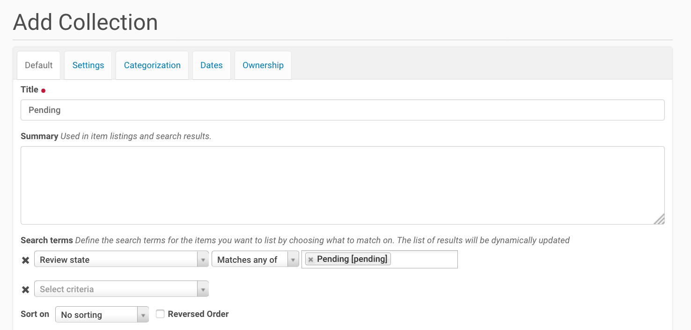
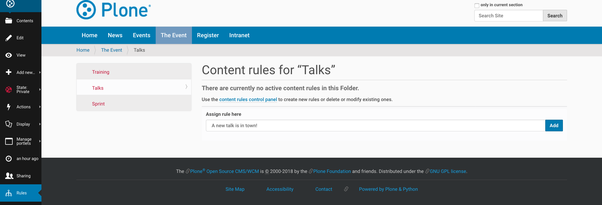

.. _features-label:

The Features of Plone
=====================

In-depth user-manual: https://docs.plone.org/

See also: https://docs.plone.org/working-with-content/index.html

.. _features-start-stop-label:

Starting and Stopping Plone
---------------------------

We control Plone with a small script called "instance"::

    $ ./bin/instance fg

This starts Plone in foreground mode so that we can see what it is doing by monitoring console messages.
This is an important development method.
Note that when Plone is started in foreground mode,
it is also automatically in development mode.
Development mode gives better feedback, but is much slower, particularly on Windows.

You can stop it by pressing :kbd:`ctrl + c`.

Apart from the `fg` command the :program:`instance` script offers several more commands.
`./bin/instance help` shows the list of available commands, `bin/instance help <command>` will give a short help for each command.
Some commands you will use rather often are::

    $ ./bin/instance fg
    $ ./bin/instance start
    $ ./bin/instance stop
    $ ./bin/instance debug
    $ ./bin/instance run myscript.py
    $ ./bin/instance adduser name password

.. only:: not presentation

    Depending on your computer, it might take up to a minute until Zope will tell you that it's ready to serve requests.
    On a decent laptop it should be running in under 15 seconds.

    A standard installation listens on port 8080, so lets have a look at our Zope site by visiting http://localhost:8080

	.. figure:: _static/features_plone_running.png

    As you can see, there is no Plone site yet!

    We have a running Zope with a database but no content.
    But luckily there is a button to create a Plone site.
    Click on that button (login: admin, password: admin).
    This opens a form to create a Plone site.
    Use :samp:`Plone` as the site id.

    .. figure:: _static/features_create_site_form.png

    You now have the option to select some add-ons before you create the site.
    Since we will use Dexterity from the beginning we select :guilabel:`Dexterity-based Plone Default Types`.
    This way even the initial content on our page will be built with Dexterity using the add-on :py:mod:`plone.app.contenttypes` which is the default in Plone 5.

    You will be automatically redirected to the new site.

.. only:: presentation

    * By default Plone listens on port 8080. Look at http://localhost:8080
    * No Plone site yet! Create a new Plone site.
    * Use :samp:`Plone` (the default) as the site id.

.. note::

    Plone has many message boxes.
    They contain important information.
    Read them and make sure you understand them!

Exercises
*********

Exercise 1
++++++++++

Open the `bin/instance` script in your favorite editor. Now let's say you want Plone to listen on port 9080 instead of the default 8080. Looking at the script, how could you do this?

..  admonition:: Solution
    :class: toggle

    At the end of the `bin/instance` script, you'll see the following code:

    .. code-block:: python

    if __name__ == '__main__':
        sys.exit(plone.recipe.zope2instance.ctl.main(
            ['-C', '/Users/pbauer/workspace/training_buildout/parts/instance/etc/zope.conf', '-p', '/Users/pbauer/workspace/training_buildout/parts/instance/bin/interpreter', '--wsgi']
            + sys.argv[1:]))

    The second to last line points to the configuration file your Plone instance is using. An absolute path is used so it might differ depending on the installation method. Open the `wsgi.ini` that lives in the same folder in your editor and look for the section:

    .. code-block:: ini

        [server:main]
        use = egg:waitress#main
        listen = 0.0.0.0:8080
        threads = 4

    Change the address to 0.0.0.0:9080 and restart your instance.

Exercise 2
++++++++++

Knowing that `bin/instance debug` basically offers you a Python prompt, how would you start to explore Plone?

..  admonition:: Solution
    :class: toggle

    Use `locals()` or `locals().keys()` to see Python objects available in Plone

Exercise 3
++++++++++

The `app` object you encountered in the previous exercise can be seen as the root of Plone. Once again using Python, can you find your newly created Plone site?

..  admonition:: Solution
    :class: toggle

    `app.__dict__.keys()` will show `app`'s attribute names - there is one called `Plone`, this is your Plone site object. Use `app.Plone` to access and further explore it.

    .. note::

        Plone and its objects are stored in an object database, the ZODB. You can use `bin/instance debug` as a database client (in the same way e.g. `psql` is a client for PostgreSQL). Instead
        of a special query language (like SQL) you simply use Python to access and manipulate ZODB objects. Don't worry if you accidentally change objects in `bin/instance debug` - you would have to commit
        your changes explicitly to make them permanent. The Python code to do so is:

        .. code-block:: pycon

            >>> import transaction
            >>> transaction.commit()

        You have been warned.

.. _features-walkthrough-label:

Walkthrough of the UI
---------------------

Let's see what is there...

* :guilabel:`header`:

  * :guilabel:`logo`: with a link to the front page
  * :guilabel:`searchbox`: search (with live-search)

* :guilabel:`navigation`: The global navigation
* :guilabel:`banner`: A banner. Only visible on the front page.

* :guilabel:`portal-columns`: a container holding:

  * :guilabel:`portal-column-one`: portlets (configurable boxes with tools like navigation, news etc.)
  * :guilabel:`portal-column-content`: the content and the editor
  * :guilabel:`portal-column-two`: portlets

* :guilabel:`portal-footer`: portlets for the footer, site actions, and colophon

* :guilabel:`edit-zone`: a vertical bar on the left side of the browser window with editing options for the content

.. only:: not presentation

    These are also the CSS classes of the respective divs.
    If you want to do theming, you'll need them.

On the edit bar, we find options affecting the current context...

* :guilabel:`folder contents`
* :guilabel:`edit`
* :guilabel:`view`
* :guilabel:`add`
* :guilabel:`state`
* :guilabel:`actions`
* :guilabel:`display`
* :guilabel:`manage portlets`
* :guilabel:`history`
* :guilabel:`sharing`
* :guilabel:`rules`
* :guilabel:`user actions`

Some edit bar options only show when appropriate;
for example, :guilabel:`folder contents` and :guilabel:`add` are only shown for Folders.
:guilabel:`rules` is currently invisible because we have no content rules available.

.. _features-users-label:

Users
-----

.. only:: not presentation

    Let's create our first users within Plone.
    So far we used the admin user (admin:admin) configured in the buildout.
    This user is often called "Zope root" and is not managed in Plone but only by Zope.
    Therefore the user is missing some features like email and full name and won't be able to use some of Plone's features.
    But the user has all possible permissions.
    As with the root user of a server, it's bad practice to make unnecessary use of Zope root.
    Use it to create Plone sites and their initial users, but not much else.

    You can also add Zope users via the terminal by entering::

        $ ./bin/instance adduser <someusername> <supersecretpassword>

    That way you can access databases you get from customers where you have no Plone user.

    To add a new user in Plone, click on the user icon at the bottom of the left vertical bar and then on :guilabel:`Site setup`.
    This is Plone's control panel.
    You can also access it by browsing to http://localhost:8080/Plone/@@overview-controlpanel

    .. figure:: _static/features_control_panel.png

    Click on :guilabel:`Users and Groups` and add a user.
    If we had configured a mail server, Plone could send you a mail with a link to a form where you can choose a password.
    (Or, if you have Products.PrintingMailHost in your buildout, you can see the email scrolling by in the console, just the way it would be sent out.)
    We set a password here because we haven't yet configured a mail server.

    Make this user with your name an administrator.

    .. figure:: _static/features_add_user_form.png

    Then create another user called ``testuser``.
    Make this one a normal user.
    You can use this user to see how Plone looks and behaves to users that have no admin permissions.

    Now let's see the site in 3 different browsers with three different roles:

        * as anonymous
        * as editor
        * as admin

.. only:: presentation

    Create some Plone users:

    #. :guilabel:`admin` > :guilabel:`Site setup` > :guilabel:`Users and Groups`
    #. Add user <yourname> (groups: Administrators)
    #. Add another user "tester" (groups: None)
    #. Add another user "editor" (groups: None)
    #. Add another user "reviewer" (groups: Reviewers)
    #. Add another user "jurymember" (groups: None)

    Logout as admin by clicking 'Logout' and following the instructions.

    Login to the site with your user now.

.. _features-mailserver-label:

Configure a Mailserver
----------------------

.. only:: not presentation

    We have to configure a mailserver since later we will create some content rules that send emails when new content is put on our site.

* Server: :samp:`localhost`
* Username: leave blank
* Password: leave blank
* Site 'From' name: Your name
* Site 'From' address: Your email address

.. only:: not presentation

    Click on `Save and send test e-mail`. Since we have configured PrintingMailHost, you will see the mail content in the console output of your instance. Plone will not
    actually send the email to the receivers address.

.. _features-content-types-label:

Content-Types
-------------

Edit a page:

* :guilabel:`Edit front-page`
* :guilabel:`Title` :samp:`Plone Conference 2018, Tokyo`
* :guilabel:`Summary` :samp:`Tutorial`
* :guilabel:`Text` :samp:`...`

Create a site structure:

* Add a folder "The Event" and in it add:

  * Folder "Talks"
  * Folder "Training"
  * Folder "Sprint"

  .. figure:: _static/features_the_event_folder_content.png
      :alt: The view of the newly created site structure.

      The view of the newly created site structure.

* In ``/news``: Add a News Item "Conference Website online!" with some image
* In ``/news``: Add a News Item "Submit your talks!"
* In ``/events``: Add an Event "Deadline for talk submission" Date: 2017/08/10

* Add a Folder "Register"
* Delete the Folder "Users"
* Add a Folder "Intranet"

	The view of the extended navigation bar.

The default Plone content types are:

* Collection
* Event
* File
* Folder
* Image
* Link
* News Item
* Page

.. note::

    Please keep in mind that we use `plone.app.contenttypes <https://docs.plone.org/external/plone.app.contenttypes/docs/README.html>`_ for the training, which are the default in Plone 5. Therefore the types are based on Dexterity and slightly different from the types that you will find in a default Plone 4.3.x site.

.. _features-folders-label:

Folders
-------

* Go to 'the-event'
* explain the difference between title, ID, and URL
* explain /folder_contents
* change the order of items
* explain bulk actions
* dropdown "display"
* default pages
* Add a page to 'the-event': "The Event" and make it the default page

.. _features-collections-label:

Collections
-----------

* add a new collection: "all content that has ``pending`` as wf_state".

	Add a collection through the web.

* explain the default collection for events at http://localhost:8080/Plone/events/aggregator/edit
* explain Topics
* mention collection portlets
* multi-path queries
* constraints, e.g. ``/Plone/folder::1``

.. _features-content-rules-label:

Content Rules
-------------

* Create new rule "a new talk is in town"!
* New content in folder "Talks" -> Send Mail to reviewers.

.. figure:: _static/features_add_rule_1.png
    :alt: Add a rule through the web.

    Add a rule through the web.

.. figure:: _static/features_add_rule_2.png
    :alt: Add an action to the rule.

    Add an action to the rule.

.. figure:: _static/features_add_rule_3.png
    :alt: Add mail action.

    Add mail action.

    Assign the newly created rule.

.. _features-history-label:

History
-------

Show and explain; mention versioning and its relation to types.

.. _features-manage-members-label:

Manage members and groups
-------------------------

* add/edit/delete Users
* roles
* groups

  * Add group "Editors" and add the user 'editor' to it
  * Add group: ``orga``
  * Add group: ``jury`` and add user 'jurymember' to it.

.. _features-workflows-label:

Workflows
---------

Take a look at the :guilabel:`state` drop down on the edit bar on the homepage.
Now, navigate to one of the folders just added.
The homepage has the status ``published`` and the new content is ``private``.

Let's look at the state transitions available for each type.
We can make a published item private and a private item published.
We can also submit an item for review.

Each of these states connects roles to permissions.

* In ``published`` state, the content is available to anonymous visitors;
* In ``private`` state, the content is only viewable by the author (owner) and users who have the ``can view`` role for the content.

A *workflow state* is an association between a role and one or more permissions.
Moving from one state to another is a ``transition``.
Transitions (like ``submit for review``) may have actions — such as the execution of a content rule or script — associated with them.

A complete set of workflow states and transitions makes up a *workflow*.
Plone allows you to select among several pre-configured workflows that are appropriate for different types of sites.
Individual content types may have their own workflow.
Or, and this is particularly interesting, they may have no workflow.
In that case, which initially applies to file and image uploads, the content object inherits the workflow state of its container.

.. note::

    An oddity in all of the standard Plone workflows: a content item may be viewable even if its container is not.
    Making a container private does **not** automatically make its contents private.

Read more at: https://docs.plone.org/working-with-content/collaboration-and-workflow/index.html

.. _features-wc-label:

Working copy
------------

Published content, even in an intranet setting, can pose a special problem for editing.
It may need to be reviewed before changes are made available.
In fact, the original author may not even have permission to change the document without review.
Or, you may need to make a partial edit.
In either case, it may be undesirable for changes to be immediately visible.

Plone's working copy support solves this problem by adding a check-out/check-in function for content — available on the actions menu.
A content item may be checked out, worked on, then checked back in.
Or it may be abandoned if the changes weren't acceptable.
Not until check in is the new content visible.

While it's shipped with Plone, working copy support is not a common need.
So, if you need it, you need to activate it via the add-on packages configuration page.
Unless activated, check-in/check-out options are not visible.

.. Note::

    Working Copy Support has limited support for Dexterity content types. The limitation is that there are some outstanding issues with folderish items that contain many items.
    See: `plone/Products.CMFPlone#665 <https://github.com/plone/Products.CMFPlone/issues/665>`_

.. _features-placeful-wf-label:

Placeful workflows
------------------

You may need to have different workflows in different parts of a site.
For example, we created an intranet folder.
Since this is intended for use by our conference organizers — but not the public — the simple workflow we wish to use for the rest of the site will not be desirable.

Plone's ``Workflow Policy Support`` package gives you the ability to set different workflows in different sections of a site.
Typically, you use it to set a special workflow in a folder that will govern everything under that folder.
Since it has effect in a "place" in a site, this mechanism is often called "Placeful Workflow".

As with working-copy support, Placeful Workflow ships with Plone but needs to be activated via the add-on configuration page.
Once it's added, a :guilabel:`Policy` option will appear on the state menu to allow setting a placeful workflow policy.
