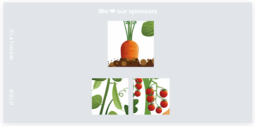

.. _volto-component-label:

======================
The Sponsors Component
======================

.. sidebar:: Volto chapter

  .. figure:: _static/Volto.svg
     :alt: Volto Logo

  This chapter is about the react frontent Volto.

  Solve the same tasks in classic frontend in chapter :doc:`viewlets_advanced_classic`

.. sidebar:: Get the code! (:doc:`More info <code>`)

   Code for the beginning of this chapter::

       git checkout TODO tag to checkout

   Code for the end of this chapter::

        git checkout TODO tag to checkout

In the previous chapter :doc:`dexterity_3` you created the ``sponsor`` content type.
Now let's learn how to display them at the bottom of every page.

To be solved task in this part:

* Advert to sponsors on all pages sorted by level

In this part you will:

* Display data from collected content

Topics covered:

* Create React component
* Use React action of Volto to fetch data from Plone via REST API
* Style component with Semantic UI

.. note::

  For sponsors we will stay with the default view since we will only display the sponsors in the footer and do not modify their own pages.
  The default-view of Volto does not show any of the custom fields you added to the sponsors.
  Using what you learned in :doc:`volto_talkview` you should be able to write a view for sponsors if you wanted to.

.. _volto-component-component-label:

A component
===========

React Components let you split the UI into independent, reusable pieces, and think about each piece in isolation.

* You can write a view component for the current context - like the ``TalkView``.
* You can write a view component that can be selected as view for a set of content objects like the TalkListView.
* You can also write components that are visible on all content objects. In classic Plone we use *viewlets* for that.

* Volto comes with several components like header, footer, sidebar. In fact everything of the UI is build of nested components.
* Inspect existing components with the React Developer Tools.

.. _volto-component-sponsors-label:

Sponsors component
==================

We will now see how to achieve in Volto frontend the equivalent to the Plone viewlet of chapter :doc:`dexterity_3`.

Overriding the Footer
---------------------

The sponsors shall live in the footer of a page. To modify the given footer component we copy the ``Footer.jsx`` file :file:`frontend/omelette/src/components/theme/Footer/Footer.jsx` from Volto. We insert the copied file to our app regarding the original folder structure but inside our customizations folder :file:`frontend/src/customizations/components/theme/Footer/Footer.jsx`.

.. only:: not presentation

  In this file ``Footer.jsx`` we can now modify the to be rendered html by adding a subcomponent ``Sponsors``. 

  Be aware that the following code is JSX. JSX is Javascript that can handle html in a handy way. What you see is a component defined as an arrow function. The function returns markup consisting of enriched html: The tag ``<Sponsors />`` forces a rendering of the Sponsors component.

.. code-block:: jsx
    :linenos:
    :emphasize-lines: 4

    const Footer = ({ intl }) => (
      <Segment role="contentinfo" vertical padded>
        <Container>
          <Sponsors />
          <Segment
            basic
            inverted
            color="grey"
            textAlign="center"
            className="discreet"
          >

.. only:: not presentation

    This will show an additional component.

    * It is visible on all pages since it is a subcomponent of footer.
    * Later on it can be made conditional if necessary.

To create the component ``Sponsors`` we add a folder :file:`frontend/src/components/Sponsors/` with a file :file:`Sponsors.jsx`. In this file we can now define our new component.

Start with a placeholder to see if your registration actually works:

.. code-block:: jsx
    :linenos:

    import React, { Component } from 'react';

    class Sponsors extends Component {
      render() {
        return <h3>We ❤ our sponsors</h3>;
      }
    }

    export default Sponsors;

.. note::

  Defining a component as a class is the classic and still valid React way. We have already seen the new approach via *hooks* in chapter :doc:`volto_talk_listview`, ``TalkListView`` component.

The component is a class extending the template class ``Component``. As you see the minimum to define is a render method which returns some markup.

Go back to your modified ``Footer`` component. The ``Footer`` component needs to know where to find the added ``Sponsor`` component. We import the ``Sponsor`` component at the top of our modified ``Footer`` component.

:file:`frontend/src/customizations/components/theme/Footer/Footer.jsx`:

.. code-block:: jsx
    :linenos:

    import { Sponsors } from '../../../../components';

The path reflects the fact that ``Footer.jsx`` lives in ``frontend/src/customizations`` whereas ``Sponsors`` lives in ``frontend/src/components``.

After restarting the frontend with ``yarn start``, we are now ready to visit an arbitrary page to see the new component. A restart is necessary on newly added files. As long as you only edit existing files of your app, your Browser is updating automagically by app configuration.

Getting the sponsors data
-------------------------

With our ``Sponsors`` component in place we can take the next step and explore Volto some more to figure out how it does data fetching.

As the data is in the backend, we need to find a way to address it. Volto provides various actions to communicate with the backend (fetching data, creating content, editing content, etc). A Redux action (that communicates with the backend) has a common pattern: It addresses the backend via REST API and updates the global app store according the response of the backend. A component calls an action and has hereupon access to the global app store (shortened: store) with the fetched data. 

For more information which actions are already provided by Volto have look at :file:`frontend/omelette/src/actions`. 

Our component will use the action ``getQueryStringResults`` to fetch data of all sponsors. It takes as arguments the path where to search, the information what to search and an argument with which key it should be stored in the store. Remember: the result is stored in the global app store.

.. todo::

    Why use getQueryStringResults? How and why is this different to what we did in the talklistview?

    Go step by step with working code for each step.

So if we call the action ``getQueryStringResults`` to fetch data of sponsors, that means data of the instances of portal type ``sponsor``, then we can access this data from the store.

The *connection* of the component to the store is made by the following code which passes the data of the store to the component prop ``items``. 

What are *props*? Props, or properties, hold dynamic information for a component. The information is passed to the props from the parent component or by a connection with the store. We have already seen the passing from parent component to subcomponent in the ``Talk`` component. It passes the date data to the ``When`` component. 

.. code-block:: jsx
    :linenos:

    <When
      start={content.start}
      end={content.end}
      whole_day={content.whole_day}
      open_end={content.open_end}
    />

The component traverses through a lifecycle (mounting, the moment where the raw structure is set, rendering, where the dynamic content is filled in, and some more lifecycle events). To have the necessary data for the rendering, we call the ``getQueryStringResults`` action on mounting the component. Therefor React has one of many lifecycle methods: ``componentDidMount``.
Read more on lifecycles in the `React documentation <https://reactjs.org/docs/react-component.html#the-component-lifecycle>`_.

.. admonition:: Call of ``getQueryStringResults`` in the lifecycle event ``componentDidMount`` of our ``Sponsors`` component:
    :class: toggle

    .. code-block:: jsx
        :linenos:
        :emphasize-lines: 14-22,61-68

        /**
        * Sponsors component.
        * @module components/Sponsors/Sponsors
        */

        import React, { Component } from 'react';
        import PropTypes from 'prop-types';
        import { connect } from 'react-redux';

        import { getQueryStringResults } from '@plone/volto/actions';

        import SponsorsBody from './SponsorsBody';

        const toSearchOptions = {
          query: [
            {
              i: 'portal_type',
              o: 'plone.app.querystring.operation.selection.any',
              v: ['sponsor'],
            },
          ],
        };

        /**
        * Component to display the sponsors.
        * @class Sponsors
        * @extends Component
        */
        class Sponsors extends Component {
          /**
          * Property types.
          * @property {Object} propTypes Property types.
          * @static
          */
          static propTypes = {
            getQueryStringResults: PropTypes.func.isRequired,
            items: PropTypes.arrayOf(
              PropTypes.shape({
                '@id': PropTypes.string,
                '@type': PropTypes.string,
                title: PropTypes.string,
                description: PropTypes.string,
              }),
            ),
          };

          /**
          * Default (values of) properties.
          * @property {Object} defaultProps Default properties.
          * @static
          */
          static defaultProps = {
            items: [],
          };

          /**
          * Component did mount
          * @method componentDidMount
          * @returns {undefined}
          */
          componentDidMount() {
            // call action getQueryStringResults
            this.props.getQueryStringResults(
              '/',
              { ...toSearchOptions, fullobjects: 1 },
              'sponsors',
            );
          }

          /**
          * Component did update
          * @method componentDidUpdate
          * @param {Object} prevProps Previous properties
          * @returns {undefined}
          *
          * Update component when a new sponsor is created / deleted / updated.
          * Two steps are necessary:
          * - subscription of a value / of values in store that reflects the fact that a new sponsor is created / deleted / updated.
          * - call search action on property change; do it here in componentDidUpdate
          */
          componentDidUpdate(prevProps) {
            if (
              // content type instance created and instance is sponsor
              (this.props.subscribedValueContent.create.loaded &&
                this.props.subscribedValueContent.data['@type'] === 'sponsor' &&
                this.props.subscribedValueContent !==
                  prevProps.subscribedValueContent) ||
              // content pasted in /contents
              (this.props.subscribedValueClipboard.request.loaded &&
                this.props.subscribedValueClipboard !==
                  prevProps.subscribedValueClipboard) ||
              // content deleted
              (this.props.subscribedValueContent.delete.loaded &&
                this.props.subscribedValueContent !== prevProps.subscribedValueContent) ||
              // content updated
              (this.props.subscribedValueContent.update.loaded &&
                this.props.subscribedValueContent !== prevProps.subscribedValueContent)
            ) {
              // then call action getQueryStringResults
              this.props.getQueryStringResults(
                '/',
                { ...toSearchOptions, fullobjects: 1 },
                'sponsors',
              );
            }
          }

          /**
          * Render method.
          * @method render
          * @returns {string} Markup for the component.
          */
          render() {
            return <SponsorsBody sponsorlist={this.props.items} />;
          }
        }

        export default connect(
          state => ({
            items: state.querystringsearch.subrequests.sponsors?.items || [],
            // subsription of something in store that is updated on creation of a sponsor
            // see docstring componentDidUpdate
            subscribedValueContent: state.content,
            subscribedValueClipboard: state.clipboard,
          }),
          { getQueryStringResults },
        )(Sponsors);

Connection of component and store
^^^^^^^^^^^^^^^^^^^^^^^^^^^^^^^^^

Let's connect the store to our component. On export we define a mapping of the requested data of the store to props of the component. With the following code the prop item is set to the fetched sponsors data from the store. It's worth exploring the store of our app with the Redux Dev Tools (additional Dev Tools to React Dev Tools) There you can see what is stored like ``state.querystringsearch.subrequests.sponsors``. And you can walk through time and watch how the store is changing.

.. code-block:: jsx
    :linenos:
    :emphasize-lines: 3

    export default connect(
      state => ({
        items: state.querystringsearch.subrequests.sponsors?.items || [],
        // subsription of something in store that is updated on creation of a sponsor
        // see docstring componentDidUpdate
        subscribedValueContent: state.content,
        subscribedValueClipboard: state.clipboard,
      }),
      { getQueryStringResults },
    )(Sponsors);

A further mapping enables the component to use the action `getQueryStringResults`. The following code maps the action to the prop of the component. What you see is a shortened definition. Read more on actions and store in `Volto documentation <https://training.plone.org/5/volto/actions-reducers.html>`_

.. code-block:: jsx
    :linenos:
    :emphasize-lines: 9

    export default connect(
      state => ({
        items: state.querystringsearch.subrequests.sponsors?.items || [],
        // subsription of something in store that is updated on creation of a sponsor
        // see docstring componentDidUpdate
        subscribedValueContent: state.content,
        subscribedValueClipboard: state.clipboard,
      }),
      { getQueryStringResults },
    )(Sponsors);

The next step is advanced and can be skipped on a first reading. As by now we fetch the sponsors data on mounting event of the component. The mounting is done once on the first visit of a page of our app. 
What if a new sponsor is added? We want to achieve a re-rendering of the component on changed sponsorship. To subscribe to these changes in sponsorship, we use our already defined connection and extend it.

.. code-block:: jsx
    :linenos:
    :emphasize-lines: 4-7

    export default connect(
      state => ({
        items: state.querystringsearch.subrequests.sponsors?.items || [],
        // subsription of something in store that is updated on creation of a sponsor
        // see docstring componentDidUpdate
        subscribedValueContent: state.content,
        subscribedValueClipboard: state.clipboard,
      }),
      { getQueryStringResults },
    )(Sponsors);

Listening to this subscription the component shall fetch the data from the store if necessary. For this the component calls the same action as before also in lifecycle event ``componentDidUpdate``.

.. code-block:: jsx
    :linenos:
    :emphasize-lines: 31-35

    /**
    * Component did update
    * @method componentDidUpdate
    * @param {Object} prevProps Previous properties
    * @returns {undefined}
    *
    * Update component when a new sponsor is created / deleted / updated.
    * Two steps are necessary:
    * - subscription of a value / of values in store that reflects the fact that a new sponsor is created / deleted / updated.
    * - call search action on property change; do it here in componentDidUpdate
    */
    componentDidUpdate(prevProps) {
      if (
        // content type instance created and instance is sponsor
        (this.props.subscribedValueContent.create.loaded &&
          this.props.subscribedValueContent.data['@type'] === 'sponsor' &&
          this.props.subscribedValueContent !==
            prevProps.subscribedValueContent) ||
        // content pasted in /contents
        (this.props.subscribedValueClipboard.request.loaded &&
          this.props.subscribedValueClipboard !==
            prevProps.subscribedValueClipboard) ||
        // content deleted
        (this.props.subscribedValueContent.delete.loaded &&
          this.props.subscribedValueContent !== prevProps.subscribedValueContent) ||
        // content updated
        (this.props.subscribedValueContent.update.loaded &&
          this.props.subscribedValueContent !== prevProps.subscribedValueContent)
      ) {
        // then call action getQueryStringResults
        this.props.getQueryStringResults(
          '/',
          { ...toSearchOptions, fullobjects: 1 },
          'sponsors',
        );
      }
    }
      

Pass prepared data for presentation
-----------------------------------

With the data fetched and accessible in the component prop ``items`` we can
now render the sponsors data:

.. code-block:: jsx
    :linenos:

    render() {
      return <SponsorsBody sponsorlist={this.props.items} />;
    }

.. admonition:: Complete code of the ``Sponsors`` component
    :class: toggle

    .. code-block:: jsx
        :linenos:
        :emphasize-lines: 3

        /**
         * Sponsors component.
         * @module components/Sponsors/Sponsors
         */

        import React, { Component } from 'react';
        import PropTypes from 'prop-types';
        import { connect } from 'react-redux';

        import { getQueryStringResults } from '@plone/volto/actions';

        import SponsorsBody from './SponsorsBody';

        const toSearchOptions = {
          query: [
            {
              i: 'portal_type',
              o: 'plone.app.querystring.operation.selection.any',
              v: ['sponsor'],
            },
          ],
        };

        /**
        * Component to display the sponsors.
        * @class Sponsors
        * @extends Component
        */
        class Sponsors extends Component {
          /**
          * Property types.
          * @property {Object} propTypes Property types.
          * @static
          */
          static propTypes = {
            getQueryStringResults: PropTypes.func.isRequired,
            items: PropTypes.arrayOf(
              PropTypes.shape({
                '@id': PropTypes.string,
                '@type': PropTypes.string,
                title: PropTypes.string,
                description: PropTypes.string,
              }),
            ),
          };

          /**
          * Default (values of) properties.
          * @property {Object} defaultProps Default properties.
          * @static
          */
          static defaultProps = {
            items: [],
          };

          /**
          * Component did mount
          * @method componentDidMount
          * @returns {undefined}
          */
          componentDidMount() {
            // call action getQueryStringResults
            this.props.getQueryStringResults(
              '/',
              { ...toSearchOptions, fullobjects: 1 },
              'sponsors',
            );
          }

          /**
          * Component did update
          * @method componentDidUpdate
          * @param {Object} prevProps Previous properties
          * @returns {undefined}
          *
          * Update component when a new sponsor is created / deleted / updated.
          * Two steps are necessary:
          * - subscription of a value / of values in store that reflects the fact that a new sponsor is created / deleted / updated.
          * - call search action on property change; do it here in componentDidUpdate
          */
          componentDidUpdate(prevProps) {
            if (
              // content type instance created and instance is sponsor
              (this.props.subscribedValueContent.create.loaded &&
                this.props.subscribedValueContent.data['@type'] === 'sponsor' &&
                this.props.subscribedValueContent !==
                  prevProps.subscribedValueContent) ||
              // content pasted in /contents
              (this.props.subscribedValueClipboard.request.loaded &&
                this.props.subscribedValueClipboard !==
                  prevProps.subscribedValueClipboard) ||
              // content deleted
              (this.props.subscribedValueContent.delete.loaded &&
                this.props.subscribedValueContent !== prevProps.subscribedValueContent) ||
              // content updated
              (this.props.subscribedValueContent.update.loaded &&
                this.props.subscribedValueContent !== prevProps.subscribedValueContent)
            ) {
              // then call action getQueryStringResults
              this.props.getQueryStringResults(
                '/',
                { ...toSearchOptions, fullobjects: 1 },
                'sponsors',
              );
            }
          }

          /**
          * Render method.
          * @method render
          * @returns {string} Markup for the component.
          */
          render() {
            return <SponsorsBody sponsorlist={this.props.items} />;
          }
        }

        export default connect(
          state => ({
            items: state.querystringsearch.subrequests.sponsors?.items || [],
            // subsription of something in store that is updated on creation of a sponsor
            // see docstring componentDidUpdate
            subscribedValueContent: state.content,
            subscribedValueClipboard: state.clipboard,
          }),
          { getQueryStringResults },
        )(Sponsors);

.. only:: not presentation

  .. note::

      Keep this common pattern in mind splitting a component in two parts: a container component to fetch data and a presentation component to render a presentation.

The presentation component
--------------------------

We create a presentation component ``SponsorsBody`` in :file:`frontend/src/components/Sponsors/SponsorsBody.jsx`

Presentation component means that this is a stateless component which gets the necessary data via props from the parent component. It doesn't communicate with the global app store, does not fetch data, doesn't do elaborated logic, it just renders the passed data of sponsors, grouped by sponsor level.

.. code-block:: jsx
    :linenos:
    :emphasize-lines: 12-47

    <Segment
      basic
      textAlign="center"
      className="sponsors"
      aria-label="Sponsors"
      inverted
    >
      

        <h3 className="subheadline">We ❤ our sponsors</h3>
      

      {sponsorlist?.length && (
        <List>
          {Object.entries(LevelVocabulary).map(level => {
            if (sponsors[level[0]].length) {
              return (
                <List.Item
                  key={level[0]}
                  className={'sponsorlevel ' + level[0]}
                >
                  <h3>{level[0].toUpperCase()}</h3>
                  <List horizontal>
                    {sponsors[level[0]].map(item => (
                      <List.Item key={item['UID']} className="sponsor">
                        {item.logo ? (
                          <Image
                            className="logo"
                            as="a"
                            href={item.url}
                            target="_blank"
                            src={flattenToAppURL(
                              item.logo.scales.preview.download,
                            )}
                            size="small"
                            alt={item.title}
                            title={item.title}
                          />
                        ) : (
                          <a href={item['@id']}>{item.title}</a>
                        )}
                      </List.Item>
                    ))}
                  </List>
                </List.Item>
              );
            }
          })}
        </List>
      )}
    </Segment>

.. todo::

    Add final code of ``SponsorsBody.jsx`` to copy.

Restart your frontend with ``yarn start`` and see the new footer. A restart is necessary since we added a new file. The browser updates automagically by configuration.

.. _volto-component-exercise-label:

Exercise
--------

Modify the component to display a sponsor logo as a link to the sponsors website. The address is set in sponsor field "url". See the documentation of `Semantic UI React <https://react.semantic-ui.com/elements/image/#types-link>`_.

..  admonition:: Solution
    :class: toggle

    .. code-block:: jsx
        :linenos:
        :emphasize-lines: 3-5

        <Image
          className="logo"
          as="a"
          href={item.url}
          target='_blank'
          src={flattenToAppURL(item.logo.scales.preview.download)}
          size="small"
          alt={item.title}
          title={item.level?.title + ' ' + item.title}
        />

    The Semantic Image component is now rendered with a wrapping anchor tag.

    .. code-block:: html
        :linenos:

        
