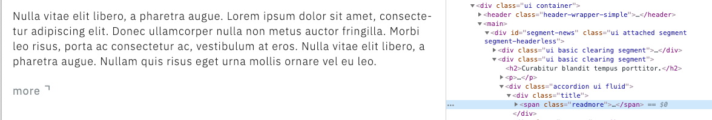
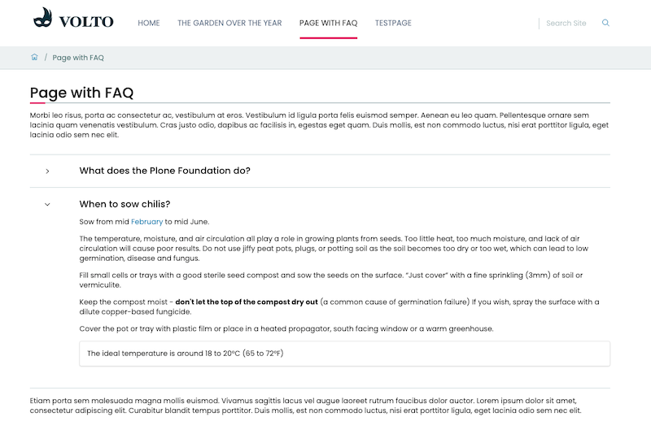

.. _volto_custom_block-label:

Custom Block
============

.. sidebar:: Volto chapter

  .. figure:: _static/Volto.svg
     :alt: Volto Logo

  Create a specialized block with some extra behavior or look.

In case you need some special look of a paragraph, a special behavior like an image gallery or even need to display data as chart, then you want to create your own block.

A very simple use case where the default text block can be extended to achieve the requested look and behavior is the following:

Use Case: *The content of a page should be teasered: Show first part and the rest on click on "read more".*

.. figure:: _static/volto_block_readmore_edit.png
    :alt: Edit view with an additonal option

The following blog post describes the few easy steps to customize a default text block in your app: https://www.rohberg.ch/de/blog/volto-customizing-blocks No need to create an add-on.

That was easy. But what if we need a FAQ section and want provide a nice form for question and answer pairs?

.. TODO:: 

    addon volto-accordion-block https://www.npmjs.com/package/@rohberg/volto-accordion-block

.. figure:: _static/faq_sidebar.png
    :alt: Editing Volto add-on volto-accordion-block

