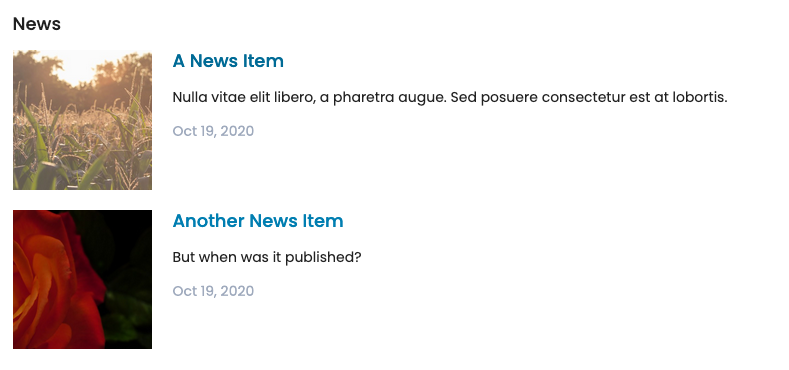

.. _volto_overrides-label:

Customizing Volto Components
============================

.. sidebar:: Volto chapter

  .. figure:: _static/volto.svg
     :alt: Volto Logo

  This chapter is about the react frontent Volto.

  Solve the same tasks in classic frontend in chapter :doc:`zpt_2`

In this part you will:

* Find out how news items are displayed
* Customize existing components

Topics covered:

* Component shadowing
* Content Type Views
* Listing Views
* Blocks

Component shadowing
-------------------

We use a technique called **component shadowing** to override an existing Volto component with our local custom version, without having to modify Volto's source code at all.
You have to place the replacing component in the same original folder path inside the ``src/customizations`` folder.

Every time you add a file to the customizations folder or to the theme folder, you must restart Volto for changes to take effect. From that point on, the hot reloading should kick in and reload the page automatically.

.. note::

    Component shadowing is very much like the good old Plone technique called "JBOT" ("just a bunch of templates").

    You can customize virtually any module in Volto, including actions and reducers, not only components.

The Logo
--------

You can use the same approach to change the Logo. Down the Plone Logo from https://www.starzel.de/plone-tutorial/Logo.svg/@@download and copy it using this path and name: ``src/customizations/components/theme/Logo/Logo.svg``.

After a restart your page should look like this:

.. figure:: _static/volto_customized_logo.png
    :alt: The customized Logo.

The Footer
----------

.. todo::

    Customize the footer (``omelette/src/components/theme/Footer/Footer.jsx``).

The News Item View
------------------

We want to show the date a News Item is published.
This way visitors can see at a glance if they are looking at current or old news.

This information is not shown by default.
So you will need to customize the way that is used to render News Items.

The Volto component to render a News Item is in ``omelette/src/components/theme/View/NewsItemView.jsx``

..  code-block:: js

    /**
     * NewsItemView view component.
     * @module components/theme/View/NewsItemView
     */

    import React from 'react';
    import PropTypes from 'prop-types';
    import { Container, Image } from 'semantic-ui-react';

    import { flattenToAppURL, flattenHTMLToAppURL } from '@plone/volto/helpers';

    /**
     * NewsItemView view component class.
     * @function NewsItemView
     * @params {object} content Content object.
     * @returns {string} Markup of the component.
     */
    const NewsItemView = ({ content }) => (
      <Container className="view-wrapper">
        {content.title && (
          <h1 className="documentFirstHeading">
            {content.title}
            {content.subtitle && ` - ${content.subtitle}`}
          </h1>
        )}
        {content.description && (
          
{content.description}

        )}
        {content.image && (
          <Image
            className="documentImage"
            alt={content.title}
            title={content.title}
            src={
              content.image['content-type'] === 'image/svg+xml'
                ? flattenToAppURL(content.image.download)
                : flattenToAppURL(content.image.scales.mini.download)
            }
            floated="right"
          />
        )}
        {content.text && (
          

        )}
      </Container>
    );

    /**
     * Property types.
     * @property {Object} propTypes Property types.
     * @static
     */
    NewsItemView.propTypes = {
      content: PropTypes.shape({
        title: PropTypes.string,
        description: PropTypes.string,
        text: PropTypes.shape({
          data: PropTypes.string,
        }),
      }).isRequired,
    };

    export default NewsItemView;

Copy that file into ``src/customizations/components/theme/View/NewsItemView.jsx``.

After restarting Volto the new file is used when diplaying a News Item.
To make sure your file is used add a small change before or after the text.
If it shows up you're good to go.

In you own projects you shoud always do a commit of the unchanged file and another commit after you changed the file.
This way you will have a commit in your git-history with the change you made.
You will thank yourself later for that clean diff!

To display the date add the following before the text:

..  code-block:: js

    
{content.created}

This will render something like ``2020-10-19T10:51:21``.
Not very user friendly.
Let's use one of many helpers available in React.

Import the library `moment <https://momentjs.com/>`_ at the top of the file and use it to format the date in a readable format.

..  code-block:: js
    :emphasize-lines: 9,44

    /**
     * NewsItemView view component.
     * @module components/theme/View/NewsItemView
     */

    import React from 'react';
    import PropTypes from 'prop-types';
    import { Container, Image } from 'semantic-ui-react';
    import moment from 'moment';

    import { flattenToAppURL, flattenHTMLToAppURL } from '@plone/volto/helpers';

    /**
     * NewsItemView view component class.
     * @function NewsItemView
     * @params {object} content Content object.
     * @returns {string} Markup of the component.
     */

    const NewsItemView = ({ content }) => (
      <Container className="view-wrapper">
        {content.title && (
          <h1 className="documentFirstHeading">
            {content.title}
            {content.subtitle && ` - ${content.subtitle}`}
          </h1>
        )}
        {content.description && (
          
{content.description}

        )}
        {content.image && (
          <Image
            className="documentImage"
            alt={content.title}
            title={content.title}
            src={
              content.image['content-type'] === 'image/svg+xml'
                ? flattenToAppURL(content.image.download)
                : flattenToAppURL(content.image.scales.mini.download)
            }
            floated="right"
          />
        )}
        
{moment(content.created).format('lll')}

        {content.text && (
          

        )}
      </Container>
    );

    /**
     * Property types.
     * @property {Object} propTypes Property types.
     * @static
     */
    NewsItemView.propTypes = {
      content: PropTypes.shape({
        title: PropTypes.string,
        description: PropTypes.string,
        text: PropTypes.shape({
          data: PropTypes.string,
        }),
      }).isRequired,
    };

    export default NewsItemView;

.. figure:: _static/volto_news_with_date.png
    :alt: A News Item with publishing date.

Now another issue appears. There are various dates associated with a content object:

* The date the item is created: ``{ content.created }``
* The date the item is last modified ``{ content.modified }``
* The date the item is published ``{ content.effective }``

In fact you most likely want to show the date when the item was published. But while the item is not yet published that value is not yet set and you will get a error. So we'll add some simple logik to use the effective-date if it exists and the creation-date as a fallback.

..  code-block:: js

    

      {(item.effective && moment(content.effective).format('lll')) ||
        moment(content.created).format('lll')}
    

.. todo::

    Add support for other locales with ``import { useIntl } from 'react-intl';`` and
    ``moment.locale(useIntl().locale);``

The Summary View
----------------

The listing of News Items in http://localhost:3000/news does not show any dates as well.

Customize the Summary View component that exists in ``omelette/src/components/theme/View/SummaryView.jsx``.

Copy that file to ``src/customizations/components/theme/View/SummaryView.jsx`` and add the following after the description:

..  code-block:: js

    

      {(item.effective && moment(item.effective).format('lll')) ||
        moment(item.created).format('lll')}
    

Note how the component iterates over the variable ``items`` of ``content``  with ``{content.items.map((item) => (...)}``. Here ``item`` is the item in the Folder or Collection where this component is used.

Excercise: Modify Listing Block
-------------------------------

When you edited the frontpage in :ref:`features-content-types-label` you may have added a Listing block to the frontpage. If not do so now.

You will see that the listing block does not display the date as well.

Copy `omelette/src/components/manage/Blocks/Listing/DefaultTemplate.jsx` to `src/customizations/components/manage/Blocks/Listing/DefaultTemplate.jsx` and add the dates as you did with the Summary View.

..  code-block:: js
    :emphasize-lines: 6,49-52

    import React from 'react';
    import PropTypes from 'prop-types';
    import { ConditionalLink } from '@plone/volto/components';
    import { flattenToAppURL } from '@plone/volto/helpers';
    import { settings } from '~/config';
    import moment from 'moment';

    import DefaultImageSVG from '@plone/volto/components/manage/Blocks/Listing/default-image.svg';
    import { isInternalURL } from '@plone/volto/helpers/Url/Url';

    const DefaultTemplate = ({ items, linkMore, isEditMode }) => {
      let link = null;
      let href = linkMore?.href || '';

      if (isInternalURL(href)) {
        link = (
          <ConditionalLink to={flattenToAppURL(href)} condition={!isEditMode}>
            {linkMore?.title || href}
          </ConditionalLink>
        );
      } else if (href) {
        link = <a href={href}>{linkMore?.title || href}</a>;
      }

      return (
        <>
          

            {items.map((item) => (
              

                <ConditionalLink
                  to={flattenToAppURL(item['@id'])}
                  condition={!isEditMode}
                >
                  {!item[settings.listingPreviewImageField] && (
                    
                  )}
                  {item[settings.listingPreviewImageField] && (
                    
                  )}
                  

                    <h3>{item.title ? item.title : item.id}</h3>
                    
{item.description}

                    
                      {(item.effective && moment(item.effective).format('ll')) ||
                        moment(item.created).format('ll')}
                    
                  

                </ConditionalLink>
              

            ))}
          

          {link && 
{link}
}
        </>
      );
    };

    DefaultTemplate.propTypes = {
      items: PropTypes.arrayOf(PropTypes.any).isRequired,
      linkMore: PropTypes.any,
      isEditMode: PropTypes.bool,
    };

    export default DefaultTemplate;

The result should look like this:

.. seealso::

    * https://training.plone.org/5/volto/override-components.html
    * https://training.plone.org/5/voltohandson/header.html#header-component
    * https://training.plone.org/5/volto/override-views.html