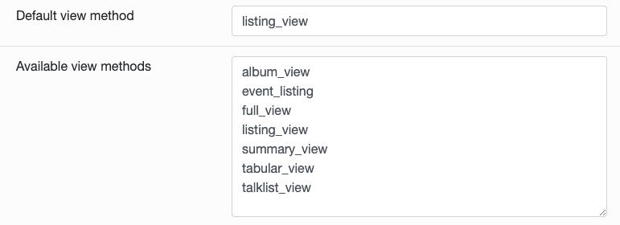
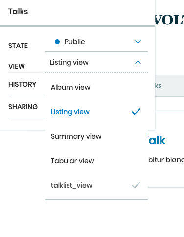

.. _volto_talk_listview-label:

Volto View Components: A Listing View for Talks
===============================================

.. sidebar:: Volto chapter

  .. figure:: _static/volto.svg
     :alt: Volto Logo

  This chapter is about the react frontent Volto.

  Solve the same tasks in classic frontend in chapter :doc:`views_3`

To be solved task in this part:

* Create a view that shows a list of talks to allow a easy overview

In this part you will:

* Register a react view component for listings
* Write the component

Topics covered:

* Use search endpoint of REST API
* Displaying data from search results

Volto has different views for listing objects. Most of them list all objects in a folder like the ``listing view``. To show all talks you have in your site you'll have to register and write your own listing view.

For doing so you have to add another new file ``src/components/Views/TalkList.jsx`` in the folder :file:`Views` you added in the last chapter.

As a first step the file will hold a placeholder again:

..  code-block:: js

    import React from 'react';

    const TalkListView = props => {
      return 
I'm the TalkList component!
;
    };
    export default TalkListView;

Then you have to edit the :file:`index.js` to export your new View:

..  code-block:: js
    :emphasize-lines: 2,4

    import TalkView from './Views/Talk';
    import TalkListView from './Views/TalkList';

    export { TalkView, TalkListView };

Now register the new component as layout view for folderish types in ``src/config.js``.

..  code-block:: js
    :emphasize-lines: 1,7-10

    import { TalkListView, TalkView } from './components';

    [...]

    export const views = {
      ...defaultViews,
      layoutViews: {
          ...defaultViews.layoutViews,
          talklist_view: TalkListView,
      },
      contentTypesViews: {
          ...defaultViews.contentTypesViews,
          Talk: Talk,
    },
    };

This extends ``defaultViews.layoutViews`` with the key/value pair ``talklist_view: TalkList``.

To add a layout view you also have to add this new view in the ``ZMI`` of your ``Plone``. Login to your instance by using ``/manage`` and unfold the point Plone in the left sidebar. Now click on ``portal_types`` and search for the ``folder``-Type to add your new ``talklist_view`` to the ``Available view methods`` by adding it to a new line.

    Add new View in the ZMI.

From now on you can select the new view for Folders:

Now we will improve this view step by step.
First we reuse the component ``DefaultView.jsx`` in our custom view again:

..  code-block:: js
    :emphasize-lines: 2,5

    import React from 'react';
    import { DefaultView } from '@plone/volto/components';

    const TalkListView = props => {
      return <DefaultView {...props} />;
    };
    export default TalkListView;

Now we want to start working directly with the context of our talks folder. To display the title and the description of the folder manually you will have to assign it at first. Afterwards you can use it to display every information the ``content`` holds like ``title`` and ``description``.

..  code-block:: js
    :emphasize-lines: 2-3,6-18

    import React from 'react';
    import { Container } from 'semantic-ui-react';
    import { Helmet } from '@plone/volto/helpers';

    const TalkListView = props => {
      const { content } = props;
      return (
        <Container className="view-wrapper">
          <Helmet title={content.title} />
          <article id="content">
            <header>
            <h1 className="documentFirstHeading">{content.title}</h1>
            {content.description && (
              
{content.description}

            )}
            </header>
          </article>
        </Container>
      )
    };
    export default TalkListView;

.. note::

    For the next part you should have some talks and no other content in one folder to work on the progressing view.

You can also iterate over all items in our talks folder by using the map ``content.items``. To build a view with some elements we used in the ``TalkView`` before, we can reuse some components and definitions like the ``color_mapping`` for the ``audience``.

..  code-block:: js
      :emphasize-lines: 2-5,9-61

      import React from 'react';
      import { Container, Segment, Label, Image } from 'semantic-ui-react';
      import { Helmet } from '@plone/volto/helpers';
      import { Link } from 'react-router-dom';
      import { flattenToAppURL } from '@plone/volto/helpers';

      const TalkListView = props => {
        const { content } = props;
        const results = content.items;
        const color_mapping = {
          Beginner: 'green',
          Advanced: 'yellow',
          Professional: 'red',
        };
        return (
          <Container className="view-wrapper">
            <Helmet title={content.title} />
            <article id="content">
              <header>
                <h1 className="documentFirstHeading">{content.title}</h1>
                {content.description && (
                  
{content.description}

                )}
              </header>
              <section id="content-core">
                {results &&
                  results.map(item => (
                    <Segment padded>
                      <h2>
                        <Link to={item['@id']} title={item['@type']}>
                          {item.type_of_talk.title}: {item.title}
                        </Link>
                      </h2>
                      {item.audience.map(item => {
                        let audience = item.title;
                        let color = color_mapping[audience] || 'green';
                        return (
                          <Label key={audience} color={color}>
                            {audience}
                          </Label>
                        );
                      })}
                      {item.image && (
                        <Image
                          src={flattenToAppURL(item.image.scales.preview.download)}
                          size="small"
                          floated="right"
                          alt={content.image_caption}
                          avatar
                        />
                      )}
                      {item.description && 
{item.description}
}
                      <Link to={item['@id']} title={item['@type']}>
                        read more ...
                      </Link>
                    </Segment>
                  ))}
              </section>
            </article>
          </Container>
        );
      };
      export default TalkListView;

* With {content.items} we iterate over the contents of the folder and assign the received map to the constant ``results`` for further use.
* With ``{results && results.map(item => ()}`` we test if there is any item in the map and then iterate over this items.
* To use the existing Link-Component we'll have to use ``import { Link } from 'react-router-dom';`` and configure the component:

    * ``to={item['@id']}`` will give make the link point to the URL of the item and assign it to the Link as destination
    * ``{item['@type']}`` will give you the contenttype name of the item, which could help you to change layouts for the listed items if you have different content in your folder
    * you can get all other information like the title, description or saved information with the dotted notation like ``{item.title}`` or ``{item.description}``
    * we use that to display ``audience``, ``image`` and ``description`` like we already did in the talkview.

The iteration over ``content.items`` to build a listing can be problematic though, because this approach has some limitations you may have to deal with:

* listed content can include different types and could have different fields or use cases (long, difficult-to-read code if every addable type/use case has to be covered) or
* not all content for the listing exists in one folder but may arranged in a wide structure (for example in topics or by day)

To get a list of all talks - no matter where they are in our site - we can use the ``search endpoint`` of the restapi.
That is the equivalent of using a catalog-search in classic Plone (see :ref:`views3-catalog-label`).

..  code-block:: js
    :emphasize-lines: 6-7,11-13,21-28

    import React from 'react';
    import { Container, Segment, Label, Image } from 'semantic-ui-react';
    import { Helmet } from '@plone/volto/helpers';
    import { Link } from 'react-router-dom';
    import { flattenToAppURL } from '@plone/volto/helpers';
    import { searchContent } from '@plone/volto/actions';
    import { useDispatch, useSelector } from 'react-redux';

    const TalkListView = props => {
      const { content } = props;
      const searchRequests = useSelector(state => state.search);
      const dispatch = useDispatch();
      const results = searchRequests.items;

      const color_mapping = {
        Beginner: 'green',
        Advanced: 'yellow',
        Professional: 'red',
      };

      React.useEffect(() => {
        dispatch(
          searchContent('/', {
            portal_type: ['talk'],
            fullobjects: true,
          }),
        );
      }, [dispatch]);

      return (
        <Container className="view-wrapper">
          <Helmet title={content.title} />
          <article id="content">
            <header>
              <h1 className="documentFirstHeading">{content.title}</h1>
              {content.description && (
                
{content.description}

              )}
            </header>
            <section id="content-core">
              {results &&
                results.map(item => (
                  <Segment padded>
                    <h2>
                      <Link to={item['@id']} title={item['@type']}>
                        {item.type_of_talk.title}: {item.title}
                      </Link>
                    </h2>
                    {item.audience.map(item => {
                      let audience = item.title;
                      let color = color_mapping[audience] || 'green';
                      return (
                        <Label key={audience} color={color}>
                          {audience}
                        </Label>
                      );
                    })}
                    {item.image && (
                      <Image
                        src={flattenToAppURL(item.image.scales.preview.download)}
                        size="small"
                        floated="right"
                        alt={content.image_caption}
                        avatar
                      />
                    )}
                    {item.description && 
{item.description}
}
                    <Link to={item['@id']} title={item['@type']}>
                      read more ...
                    </Link>
                  </Segment>
                ))}
            </section>
          </article>
        </Container>
      );
    };

    export default TalkListView;

We make use of the ``useSelector`` and ``useDispatch`` hooks from the react-redux library. They are used to subscribe our component to the store changes (``useSelector``) and for issuing Redux actions (``useDispatch``) from our components.

Afterwards we can define the new results with ``const results = searchRequests.items;``, which will use the hooks and actions to receive a map of items.

The search itself will be defined in the ``React.useEffect(() => {})``- section of the code and will contain all parameters for the search. In case of the talks listing view we search for all objects of type talk with ``portal_type:['Talk']`` and force to fetch full objects with all information.

The items themselves won't change though, so the rest of the code will stay untouched.

Now you see all talks in the list no matter where they are located in the site.

.. warning::

  If you change the view in Volto you’ll also change the view in the backend (Plone). As long as the same view isn’t available in the backend too, the site will show an error!

Search options
--------------

.. todo::

  * Explain available indexes, path, sort_on
  * Explain why we cannot search for ``type_of_talk`` yet.
  * Explain default results, metadata_fields, fullobjects, how that relates to portal_catalog and brains.
  * Explain difference between brain and object

.. seealso::

  * https://plonerestapi.readthedocs.io/en/latest/searching.html
  * http://docs.plone.org/develop/plone/searching_and_indexing/query.html

.. _volto_talk_listview-label:

Exercises
---------

Since you now know how to query content it is time for some exercise.

Exercise 1
**********

Add a criteria in the search and sort the talks in the order of their modification date.

..  admonition:: Solution
    :class: toggle

    .. code-block:: python
        :linenos:

        React.useEffect(() => {
          dispatch(
            searchContent('/', {
              portal_type: ['Talk'],
              sort_on: 'modified',
              fullobjects: true,
            }),
          );
        }, [dispatch]);
