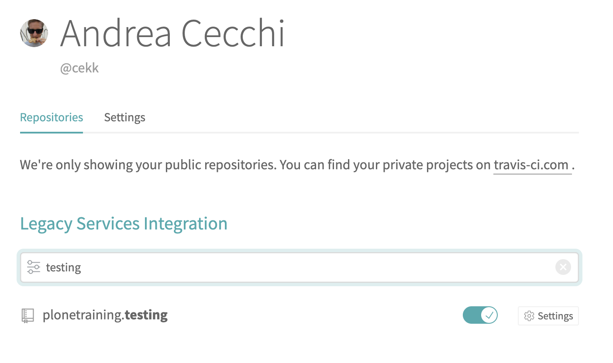
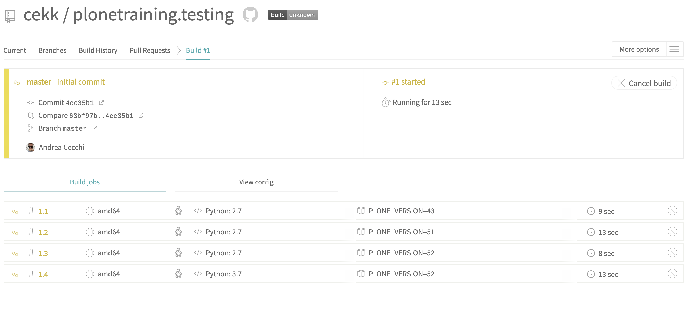

Continuous Integration
======================

During this training we have seen how to test different parts of Plone and different testing techniques.

In this final chapter, we are going to see how to configure products for ``continuous integration`` (CI).

Continuous Integration is the practice of merging in small code changes frequently
rather than merging in a large change at the end of a development cycle.

Each merge should be checked to avoid problems and regression errors and that's the reason why testing our products is important.

With version control platforms this means that for every push, all tests should be run and need to pass before merging one feature.

Bitbucket and GitLab provides internal CI tools. GitHub doesn't provide a CI tool, but Travis-CI can be synced with a GitHub repository.

Each system has its own configuration syntax, but they work in the same way:

- They need to be synced to a defined repository.
- When en event is triggered on that repository (usually a commit), a ``build`` starts.
- A build is a group of ``jobs`` (could be one or more in parallel) that finishes when all of its jobs are finished.
- A ``job`` is an automated process that clones a repository into a virtual environment and then carries out a series of phases such as compiling code, running tests, etc. A job fails, if the return code of the script phase is non-zero.
- A build fails if one or more jobs fails.

Configuring builds to run parallel jobs is useful when our package need to keep compatibility with several Plone/Python versions
because manually testing each change for each version could be painful and time consuming.

If we look closer to ``*.cfg`` files created by plonecli, we can see that they are built in a way that it's possible to run buildouts for:

- Plone 43
- Plone 50
- Plone 51
- Plone 52

Configuration files for CI created from ``plonecli`` are built for use the right buildout for each Plone version needed.

Travis-CI
---------

The most common used CI service for collective products is Travis-CI.
Basically because ``collective`` and ``plone`` repositories are on ``GitHub``.

Let's see how to enable our testing package on Travis.

First of all we need to create a repo on GitHub (we don't need to push code right now).

Then we need a Travis-CI account: go to `https://travis-ci.org <https://travis-ci.org>`_ and signup with your GitHub credentials.

If we go to settings control panel, we can see a list of organizations and repositories that we can handle.
We could also see our newly created repo and we can enable it.

.. note::
    Repositories list is periodically synced. If you don't see new repos, try to click ``refresh`` button.

By default, Travis-CI will run tests for each push made in the repository (also in pull-requests) and can also manually triggered (only for ``master`` branch).

For this reason, to trigger the first test run, we can do our fist commit to the repo:

.. code:: console

    > git remote add origin git@github.com:your-username/plonetraining.testing.git
    > git push -u origin master

This action will trigger Travis-CI hooks, and you could see that something starts:

In this screenshot we can see that a new build has started with 4 parallel jobs.
That's because Travis-CI configuration file was set to run tests for 4 different Plone versions.

While we wait the tests to be completed, let's see how to configure Travis-CI.

.. note::

    The very first time that a test runs on Travis-CI, it could take more time because it don't have any kind of cache.

Travis-CI integration works only if there is file in the repository named ``.travis.yml``.
This file contains all the configurations needed by Travis-CI to run our tests:

.. literalinclude:: _snippets/.travis.yml
    :language: ini
    :lines: 1-7

Here we define some system informations.
For each triggered test, Travis-CI instantiate a virtual machine and we can setup several options like:

- Linux distribution
- If we need to keep some folders cached (to speedup future tests)
- Main language used in tests: in this case, Travis-CI enables also additional tools like virtualenv

.. literalinclude:: _snippets/.travis.yml
    :language: ini
    :lines: 8-19

Here we are selecting default python (and virtualenv) version for our tests.

If we need to test our product only for one specific Plone version (and a specific Python version as side effect), we only need to specify Python version in ``python`` section.

Otherwise, we can define a ``build matrix``. Travis-CI will start multiple parallel jobs (one per matrix entry) using defined variables.

In our case we want to test 4 different Plone versions.

.. literalinclude:: _snippets/.travis.yml
    :language: ini
    :lines: 22-36

``before_install``, ``install`` and ``before_script`` are sequential steps called ``phases`` where we can define some actions to execute at a specified step.

``before_install`` is usually used to install some system libraries or setup something before actual installation.

``ìnstall`` is the phase where we install everything is needed to run tests (aka: run the buildout).

``before_script`` is the phase right before running tests scripts and could be useful to tweak some system setups like enabling X virtual frame buffer (Xvfb) to run Robot tests.

.. note::
    
    We are using an environment variable set in build matrix (``$PLONE_VERSION``) to run the correct Plone version.

.. literalinclude:: _snippets/.travis.yml
    :language: ini
    :lines: 37-41

``script`` is the phase where we actually run tests.
With tests we don't mean only the integration/functional/robot tests that we have previously write,
but anything that can evaluate the quality of our product and can fail.

In our case, we are running two tests:

- ``bin/code-analysis``: a script that checks if all python code in our repository follows some coding styleguides (see later in this chapter).
- ``bin/test --all``: the same script that we run in our local tests (it's the same as running ``plonecli test --all``).

.. literalinclude:: _snippets/.travis.yml
    :language: ini
    :lines: 42-48

If all tests ends succesfully, we can also define some actions to do after that, like creating a coverage report for example.

.. note::

    See `Travis-CI documentation <https://docs.travis-ci.com/user/job-lifecycle/>`_ to see all the things that we can do after a job success or failure.

.. note::

    - If a command in the before_install, install, or before_script phase returned a non-zero exit code, the job stops immediately and result is set as ``errored``.
    - If a command in the script phase returned a non-zero exit code, the job continues to run until it completes and result is set as ``failed``.
    - Otherwise, result is set as ``passed``

Going back to our builds (they should have finished).

If you ignored code-analysis reports on commits in your local repository (as we do), probably you will have all tests failed.

Clicking on a single job, we can see its console log, and we should see an error like this:

.. image:: ./_static/travis_error_code_analysis.png
    :scale: 50%

This means that code-analys test failed, and so that job has been marked as failed.

``code-analysis`` is a buildout-generated script that provides static code analysis with different code checks like flake8, JSHint, CSS Lint, etc.

code-analysis script is generated with `plone.recipe.codeanalysis <https://github.com/plone/plone.recipe.codeanalysis>`_:

.. literalinclude:: _snippets/buildout.cfg
    :language: ini
    :lines: 35-39

To check the code of our repository, we need to run this command:

.. code-block:: console

  $ bin/code-travis_error_code_analysis
  
plone.recipe.codeanalysis creates also a git ``pre-commit`` hook that runs that command on every ``commit``.

The output is a list of things that need to be fixed with the reference of file and row.

Excercise
+++++++++

Try to fix all code-analysis errors and commit your changes to have all green jobs on Travis-CI

GitLab
------

We are not going to covering GitLab configuration in this training, but `plonecli` creates also a GitLab configuration file.

GitLab (and BitBucket) have its internal CI machinery, so if you have a project on GitLab, you only need to enable its CI/CD feature and provide a ``.gitlab-ci.yml`` configuration file.

It has a syntax similar to Travis-CI one. You can find all details in the `online documentation <https://docs.gitlab.com/ee/ci/>`_.

tox
---

``tox`` is a command line tool that is a part of a larger vision: standardize testing in Python.

It is a generic virtualenv management and test command line tool you can use for:

- Checking your package installs correctly with different Python versions and interpreters
- Running your tests in each of the environments, configuring your test tool of choice
- Acting as a frontend to Continuous Integration servers, greatly reducing boilerplate and merging CI and shell-based testing.

Basically it does what a CI service does (running parallel test jobs), but locally.

To use tox, you have to install it:

.. code-block:: console

  $ pip install tox

After that, you need a ``tox.ini`` configuration file where to setup everything you need to execute tests:

.. literalinclude:: _snippets/tox.ini
    :language: ini

The most important part is ``envlist`` where we are defining a matrix for all versions of Plone/Python that we want to test.
We can also provide a bash-like list of options like ``py{27,37}-Plone{52}`` if we want to run Plone52 with python27 and python37.

Other parts of this configuration file, are a set of setups and commands that tox will read and execute for each environment in the matrix.

You can run tox with this command:

.. code-block:: console

  $ tox

With that command, tox will read the envlistt matrix and execute ``commands`` for each one.

For each matrix element, tox will create a separate environment (with virtualenv), installs dependencies and runs ``commands``.

Only if all environments ran successfully tox will return exit code 0 (success). In this case you’ll also see the message ``congratulations :)``.

Excercise
+++++++++

Try to install and run tox locally.

.. note::

    You can list available environments with:

    .. code-block:: console

        $ tox -l
    
    and then run only one environment with:

    .. code-block:: console

        $ tox -e py37-Plone52
