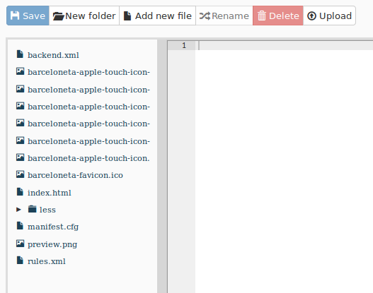

========================================================================
TTW advanced: intro to Diazo Theming, build custom rules through the web
========================================================================

A Plone theme takes uses ``Diazo`` techonology to make theming easier.

You can find extended information about Diazo and its integration package ``plone.app.theming`` in the official docs: `Diazo docs <http://docs.diazo.org/en/latest/>`_
and `plone.app.theming docs <http://docs.plone.org/external/plone.app.theming/docs/index.html#what-is-a-diazo-theme>`_.

For this part of the training you just need to know the basic principles of a Diazo theme:

* Plone renders the content of the page;
* Diazo rules inject the content into any static theme;

Copy barceloneta theme
----------------------

To create our playground we will copy the existing Barceloneta theme.

1. go the "Theming" control panel
2. you will see the available themes. In a bare new Plone site, you will see something like this:

.. image:: _static/theming-bare_plone_themes_list.png
   :align: center

3. click on the "copy" button and get to the copy form
4. insert "My theme" as the name and activate it by default

.. image:: _static/theming-copy_theme_form.png
   :align: center

5. click on create and you get redirected to your new theme's inspector:

Anatomy of a Diazo theme
------------------------

The most important files:

* ``manifest.cfg``: contains metadata about the theme (`manifest reference <http://docs.plone.org/external/plone.app.theming/docs/index.html#the-manifest-file>`_);
* ``rules.xml``: contains the theme rules (`rules reference <http://docs.plone.org/external/plone.app.theming/docs/index.html#rules-syntax>`_);
* ``index.html``: the static HTML of the theme.

Custom rules
------------
Let's open ``rules.xml``. You will see all the rules that are used in Barceloneta theme right now. For the time being let's concentrate on how to hack these rules.

Suppose that we want to make the "above content" block (the one that contains breadcrumbs) conditional, and show it only for authenticated users and PUT HERE ANOTHER EXAMPLE (?).

Find this line:

.. code-block:: xml

    <replace css:content="#viewlet-above-content" css:theme="#above-content" />

This rule states that the element that come from the content (Plone) with the id `#viewlet-above-content` must replace the element with the id `#above-content` in the static theme.

We want to hide it for anynoymous users so we can take advantage of the base CSS classes the Plone exposes on the body (SHOW THE CLASSES).

The class we are looking for is `userrole-authenticated`. Add another property to the rule so that we produce this code:

.. code-block:: xml

    <replace
        css:if-content="body.userrole-authenticated"
        css:content="#viewlet-above-content"
        css:theme="#above-content" />

The attribute `css:if-content` allows us to put a condition on the rules based on a CSS selector that acts on the content. In this way the rule will be applied only if the body element has the class `.userrole-authenticated`.

MORE EXAMPLES HERE?

Customize CSS
-------------

1. from theme editor open the file `less/barceloneta.plone.less`, that is the main LESS file as specified in the manifest;
2. add your own customization at the bottom, like:

.. code-block:: css

    body{ background-color: red; font-size: 18px ;};

*Note: normally you would place this in a separate file to keep the main one clean but for this example is enough.*

3. push the button "Build CSS"

.. image:: _static/theming-editor_compile_css.png
   :align: center

4. go back to the plone site and reload the page: voilá!

..  Warning::

    At the moment you need to "Build CSS" from the main file, the one declared in the manifest (in this case `less/barceloneta.plone.less`). So, whatever LESS file you edit, go back to the main one to compile. This behavior will be improved but for now, just remember this simple rule ;)
