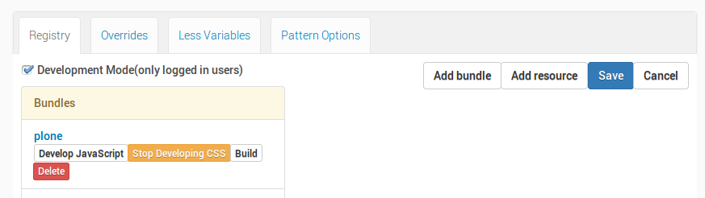
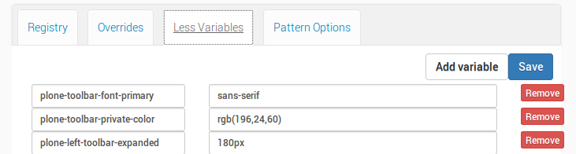

================================================
Basic: customizing logo and CSS of default theme
================================================

Customize logo
--------------

1. go to plone control panel: toolbar -> admin -> Site Setup
2. go to "Site" control panel
3. you will see this form

.. image:: http://docs.plone.org/_images/change-logo-in-site-control-panel.png

4. You can now add / remove your custom logo

See `official docs <http://docs.plone.org/adapt-and-extend/change-the-logo.html>`_.

Customize CSS/LESS variables
----------------------------

1. go back to control panel
2. got to "Resource Registries" control panel
3. on the first tab: enable "Development Mode"
4. in the "plone" bundle below, click on "develop CSS".

Your panel should now look like this

Now we can play with some LESS variables:

1. go to "Less Variables" tab
2. find the var ``plone-left-toolbar-expanded`` and set it to 400px

3. hit save button upper right and reload the page
4. click on the toolbar logo to expand the toolbar: voilá!

You can play around with some other var, if you want.

..  Warning::

    "Development Mode" is really expensive for the browser, so depending on the browser and on the system you might encounter extreme slowness while rendering the page. You could see an unthemed page for a while.
    Remember to switch it off as soon as you finished tweaking.
